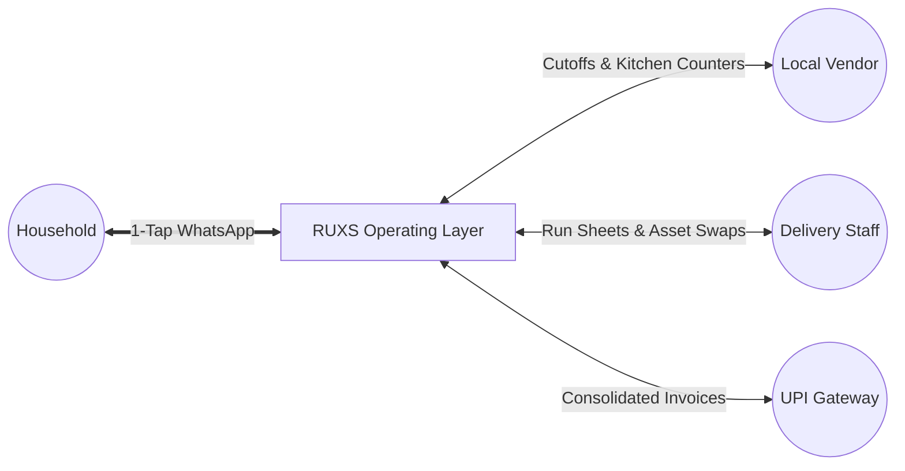

# RUXS (`ruxs.in`)

> **The Operating System for Everyday Household Life.**  
> Hyper-local recurring services (Tiffin, Water, Milk, Flowers, Newspapers, Laundry, Cleaning, Scrap) on complete autopilot.

[](https://ruxs.in)
[](https://workers.cloudflare.com/)
[-black.svg)](https://github.com/cloudflare/vinext)
[](#development-status)

---

## Current Development Status

> ⚠️ **IMPORTANT ARCHITECTURAL NOTICE:**  
> **CURRENT STATUS: Product Definition & System Architecture Phase (Phase 0).**  
> **This repository is currently in the technical specification and architecture phase. NO PRODUCTION APPLICATION CODE OR DATABASE MIGRATIONS HAVE BEEN IMPLEMENTED YET.**  
> The comprehensive specifications in [`/docs`](file:///Users/shaswatraj/Desktop/ruxx/docs/README.md) serve as the foundation for future autonomous and pair-programmed engineering execution.

---

## 1. What is RUXS?

Every day across urban and semi-urban India, millions of households rely on an informal ecosystem of recurring daily essentials:
* Morning milk delivered to the doorstep bag
* Fresh homestyle lunch and dinner tiffins
* Heavy 20-liter RO water cans hoisted into kitchens
* Daily newspapers and fresh morning temple flowers
* Weekly laundry and dhobi pickups
* Daily car dusting and scrap cardboard collection

Today, this multi-billion dollar recurring economy operates through chaotic WhatsApp messages, forgotten phone calls, scribbled door calendars, disputed paper notebooks (*Khata*), and lost physical containers (cans, dabbas).

**RUXS is not a dark-store grocery marketplace.** We do not replace the neighborhood vendor.  
Instead, **RUXS is the digital operating system underneath that relationship**—connecting customers, subscriptions, daily fulfillment state machines, vendor kitchens, delivery staff, and double-entry ledgers into an automated, zero-friction experience.



---

## 2. The Core Value Proposition

* **Zero-Friction Autopilot:** 1-tap morning WhatsApp interactive polls (`[DELIVER]`, `[SKIP]`, `[EXTRA]`). If ignored, runs safely on your pre-configured autopilot default.
* **Strict Cutoff Enforcement:** Enforces configurable operational windows (e.g., 10:00 AM lunch cutoff), eliminating 15–25% kitchen food wastage.
* **Digital Khata (Financial Ledger):** No arbitrary balance changes. Every rupee owed traces back to a verified timestamped delivery in an append-only double-entry ledger.
* **Physical Asset Ledger:** Real-time container accounting at the doorstep for 20L water cans and stainless steel tiffins, ending container loss and deposit friction.
* **Consolidated Monthly Invoicing:** Automatically derived statements dispatched on the 1st of the month with instant 1-click UPI payment links.
* **Household Expense Splitting (Phase 5):** Splitwise-style shared bill division for flatmates directly on top of verified invoices.

---

## 3. Initial Service Categories

| Service Category | Cadence | Physical Asset Tracking | Target Milestone |
| :--- | :--- | :---: | :--- |
| **Tiffin Services (Lunch / Dinner)** | Daily / Shift | Yes (Tiffin Dabbas) | **Phase 1 (MVP Beachhead)** |
| **20L RO Water Jars** | 2–3 Days / SOS | Yes (Cans + Deposits) | **Phase 1 (MVP Beachhead)** |
| **Fresh Milk & Dairy** | Daily Dawn | Optional (Bottles/Crates) | Phase 2 |
| **Daily Car / Bike Cleaning** | Daily Morning | No | Phase 2 |
| **Newspapers & Periodicals** | Daily Dawn | No | Phase 2 |
| **Pooja Flowers** | Daily Dawn | Yes (Baskets) | Phase 3 |
| **Laundry / Dhobi** | Bi-weekly | Yes (Numbered Bags) | Phase 4 |
| **Dry Scrap & Carton Collection** | Weekly / On-Demand | Yes (Weighed Credit) | Phase 4 |

---

## 4. Documentation Map

The project contains comprehensive, high-density specifications in the [`/docs`](file:///Users/shaswatraj/Desktop/ruxx/docs/README.md) directory:

```
docs/
├── README.md                           # Master Documentation Directory
├── product/                            # Product Strategy, Scope & Domain
│   ├── vision.md                       # Long-term vision & operating layer thesis
│   ├── problem.md                      # The manual chaos in recurring services
│   ├── solution.md                     # The digital coordination layer
│   ├── value-proposition.md            # Stakeholder value pillars (Customer, Vendor, Driver)
│   ├── target-users.md                 # 5 User roles & real-world personas
│   ├── service-categories.md           # 9 Detailed service specifications
│   ├── product-principles.md           # 10 Immutable product principles
│   ├── mvp.md                          # Phase 1 scoped MVP vs deferred features
│   ├── roadmap.md                      # Phased evolution (Phase 0 to Phase 6)
│   ├── metrics.md                      # KPIs (Customer, Vendor, Operational, Financial)
│   ├── open-questions.md               # Active product & strategic dilemmas
│   ├── risks.md                        # Risk matrix & mitigation plans
│   └── edge-cases.md                   # 20+ Real-world operational failure scenarios
├── features/                           # Technical Feature Specifications
│   ├── subscriptions.md                # Cadence patterns & schedule lifecycle
│   ├── daily-fulfillment.md            # The 11-state fulfillment state machine
│   ├── cutoff-system.md                # Cutoff locking & batch counter
│   ├── khata.md                        # Transactional double-entry financial ledger
│   ├── asset-ledger.md                 # 20L can & tiffin dabba tracking
│   ├── billing.md                      # Monthly invoice aggregation & statements
│   ├── payments.md                     # UPI-first payment gateway abstraction
│   ├── whatsapp.md                     # Meta Cloud API interactive buttons & webhooks
│   ├── notifications.md                # Multi-channel event-driven notifications
│   ├── delivery.md                     # Sequenced run sheets & society routing
│   ├── delivery-verification.md        # Geostamps, drop photos & dispute evidence
│   ├── vacation-mode.md                # Multi-service bulk pause windows
│   ├── household.md                    # Shared flatmate accounts & roles
│   ├── expense-splitting.md            # Splitwise-style roommate billing (Phase 5)
│   └── disputes.md                     # Ledger arbitration & dispute workflows
├── architecture/                       # System Architecture & Engineering
│   ├── overview.md                     # Edge topology & component diagrams
│   ├── principles.md                   # 17 Core architectural guidelines
│   ├── domain-model.md                 # DDD Bounded contexts & aggregates
│   ├── data-model.md                   # Conceptual relational entity models & ERDs
│   ├── authentication.md               # Phone OTP, edge JWT sessions & magic links
│   ├── authorization.md                # RBAC matrix across 5 roles
│   ├── multi-tenancy.md                # Tenant isolation & PostgreSQL RLS
│   ├── notifications.md                # Asynchronous queue & rate limiting infra
│   ├── integrations.md                 # Meta WhatsApp, UPI, SMS & Cloudflare R2
│   ├── background-jobs.md              # Midnight generator, cutoffs & billing crons
│   └── events.md                       # Typed domain event catalog & envelopes
├── business/                           # Commercial Strategy & Economics
│   ├── business-model.md               # Hybrid SaaS & collection infrastructure
│   ├── vendor-plans.md                 # Starter (Free), Growth (₹499), Pro (₹1,499)
│   ├── unit-economics.md               # Per-household COGS & vendor 23x ROI
│   └── go-to-market.md                 # 3km high-density cluster & vendor Trojan Horse
├── operations/                         # Standard Operating Procedures (SOPs)
│   ├── vendor-operations.md            # Day in the life of a kitchen / depot
│   ├── delivery-operations.md          # Driver doorstep run sheet protocols
│   ├── customer-support.md             # Tier 1 & Tier 2 support playbooks
│   └── dispute-management.md           # Evidence arbitration rules of engagement
├── security/                           # Security, Privacy & Threat Modeling
│   ├── security.md                     # Ingress HMAC signatures & application controls
│   ├── privacy.md                      # PII handling & India DPDP Act compliance
│   └── threat-model.md                 # STRIDE threat matrix & mitigations
├── decisions/                          # Architecture Decision Records (ADRs)
│   ├── README.md                       # ADR index & guidelines
│   └── ADR-001-initial-architecture.md # Next.js / Vinext / Cloudflare / Postgres
└── development/                        # Engineering Execution Standards
    ├── development-principles.md       # Immutable developer directives
    ├── coding-guidelines.md            # TypeScript strictness, Zod & envelopes
    ├── testing-strategy.md             # Ledger invariants & state machine testing
    └── deployment.md                   # Cloudflare edge deploy & migration workflow
```

---

## 5. Technology Stack Summary

* **Frontend & Edge Runtime:** [Next.js App Router](https://nextjs.org/) powered by [Vinext](https://github.com/cloudflare/vinext) on [Cloudflare Workers](https://workers.cloudflare.com/) (Edge V8 Isolates)
* **Package Manager & Bundler:** [Bun](https://bun.sh/) & [Vite](https://vite.dev/)
* **Primary Language & Styling:** [TypeScript](https://www.typescriptlang.org/) (Strict Mode) + [Tailwind CSS](https://tailwindcss.com/)
* **Primary Relational Store:** [PostgreSQL](https://www.postgresql.org/) with Row-Level Security (RLS) & [Drizzle ORM](https://orm.drizzle.team/)
* **Caching & Distributed Locks:** [Redis](https://redis.io/) (Upstash / Cloudflare KV)
* **Object Storage:** [Cloudflare R2](https://www.cloudflare.com/developer-platform/r2/) (Zero-egress S3 compatible)
* **Conversational Interface:** [Meta WhatsApp Cloud API](https://developers.facebook.com/docs/whatsapp/cloud-api/)
* **Payment Layer:** UPI-First Payment Gateway Abstraction ([Cashfree](https://www.cashfree.com/) / [Razorpay](https://razorpay.com/))

---

## 6. Scripts Reference

```bash
# Install dependencies
bun install

# Start local development server
bun run dev

# Compile edge-ready production build
bun run build

# Start production build locally with Wrangler
bun run preview

# Deploy Cloudflare Worker to production
bun run deploy
```

---

## 7. License & Rights

Copyright © 2026 RUXS (`ruxs.in`). All rights reserved.
