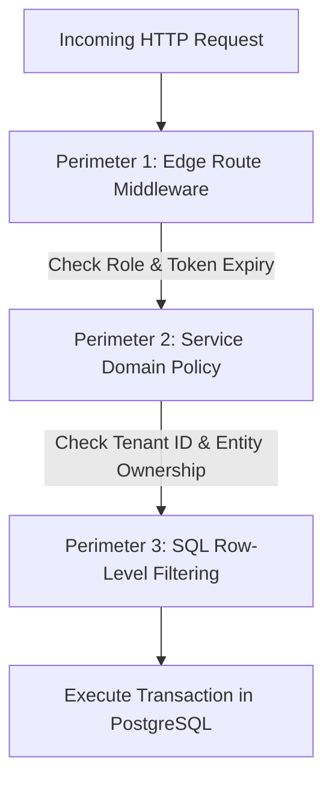

# Architecture Specification: Authorization & RBAC

**Classification:** `[CONFIRMED PRODUCT REQUIREMENT]`

---

## 1. Role-Based Access Control (RBAC) Matrix

RUXS enforces a strict role hierarchy across five user roles:

```mermaid
graph TD
    PA[Platform Admin] -->|Platform-wide Audit & Override| All[All Entities]
    
    subgraph Vendor Boundary
        VA[Vendor Admin] -->|Full Control over Tenant| VT[Tenant Catalog, Khata, Staff]
        DS[Delivery Staff] -->|Read-Only Stops, Write Delivery/Assets| VOps[Assigned Run Sheet]
    end

    subgraph Household Boundary
        CO[Primary Customer] -->|Manage Subscriptions, Settle Bills| HH[Household Unit]
        HM[Household Member] -->|View Subscriptions, Skip (if enabled), Split| HM_Ops[Household Activity]
    end
```

### Granular Permission Matrix

| Resource / Action | Customer | Household Member | Vendor Admin | Delivery Staff | Platform Admin |
| :--- | :---: | :---: | :---: | :---: | :---: |
| **Manage Subscriptions** | Own | View Only | Own Tenant | No | Global |
| **Trigger Daily Skip** | Own | If Granted | Override | No | Global |
| **View Digital Khata** | Own | Own Household | Own Tenant | No | Global |
| **Mutate Ledger / Refund** | No | No | Own Tenant | No | Global |
| **Mark Order DELIVERED** | No | No | Yes | Assigned Stops | Global |
| **Record Asset Handover**| No | No | Yes | Assigned Stops | Global |
| **Configure Cutoffs & SKUs**| No | No | Own Tenant | No | Global |
| **View Driver Run Sheet**| No | No | Own Tenant | Assigned Run | Global |
| **Settle Monthly Invoice**| Own | Split Share | Reconcile | No | Global |
| **Arbitrate Disputes** | Open Ticket| Open Ticket | Resolve | No | Final Arbiter |
| **Manage SaaS Billing** | No | No | Own Account | No | Global |

---

## 2. Enforcement Architecture

Authorization is verified across three independent defense perimeters:



### Perimeter 1: Edge Route Middleware
* Quick rejection of unauthenticated or wrong-role requests before hitting application compute.
* Example: `/api/vendor/*` requires `role === "VENDOR_ADMIN"`.

### Perimeter 2: Service Domain Policies
* Fine-grained domain logic checks:
  * *"Is this user a member of the household associated with this subscription?"*
  * *"Does this delivery stop belong to the driver currently logged in?"*

### Perimeter 3: Multi-Tenant SQL Scoping
* Every query automatically applies a tenant or user scope:
  ```sql
  SELECT * FROM daily_fulfillments 
  WHERE tenant_id = $session.tenant_id 
    AND id = $request.fulfillment_id;
  ```
