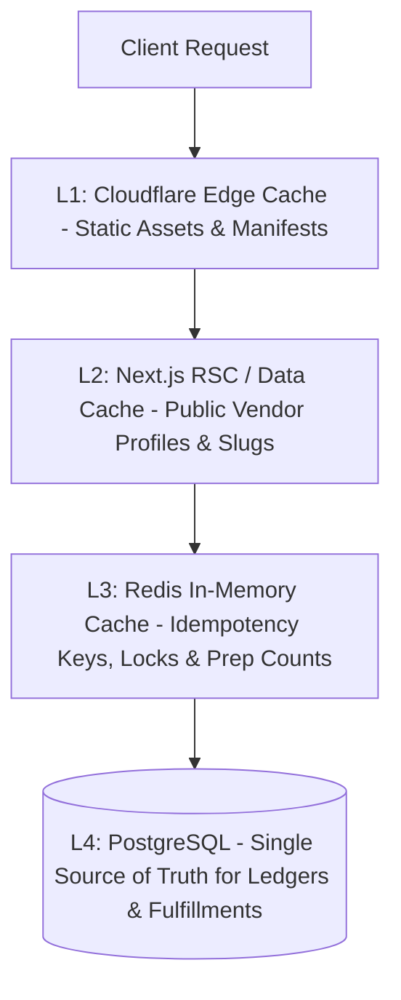

# Architecture Specification: Caching Strategy & Distributed Locks

**Classification:** `[CONFIRMED ARCHITECTURAL SPECIFICATION]`

---

## 1. Multi-Tiered Caching Hierarchy

RUXS employs a disciplined caching hierarchy, distinguishing between safe read-cached data and strictly non-cached financial ledgers:

---

## 2. Caching Rules by Domain Area

| Data Classification | Storage Layer | TTL | Invalidation Strategy |
| :--- | :--- | :---: | :--- |
| **Static Assets (CSS, Icons, Fonts)** | Cloudflare Edge CDN | 30 Days | Content-hashed filenames |
| **Public Vendor Slugs / Catalogs** | Edge KV / Next.js ISR | 5 Minutes | On-demand revalidation on catalog edit |
| **Webhook Idempotency Keys** | Redis (Upstash) | 24 Hours | Key-based expiration |
| **Live Kitchen Prep Counter** | Redis | 15 Seconds | Recomputed upon every cutoff or fulfillment change |
| **Active Driver Run Sheet** | Redis / Stale-While-Revalidate | 30 Seconds | Cache invalidated on delivery tap |
| **Digital Khata & Balances** | **NEVER CACHED** | 0s | Direct ACID PostgreSQL query |
| **Invoices & Payment Records** | **NEVER CACHED** | 0s | Direct ACID PostgreSQL query |

---

## 3. Distributed Mutex Locks (Redis Redlock)

To prevent race conditions on critical boundaries (such as concurrent skips and delivery taps, or duplicate payment webhook processing):
* Lock pattern: `SET lock:{tenant_id}:{fulfillment_id} {token} NX PX 5000` (5-second lock timeout).
* The worker acquires the lock, executes the state transition within a database transaction, and releases the lock safely.
