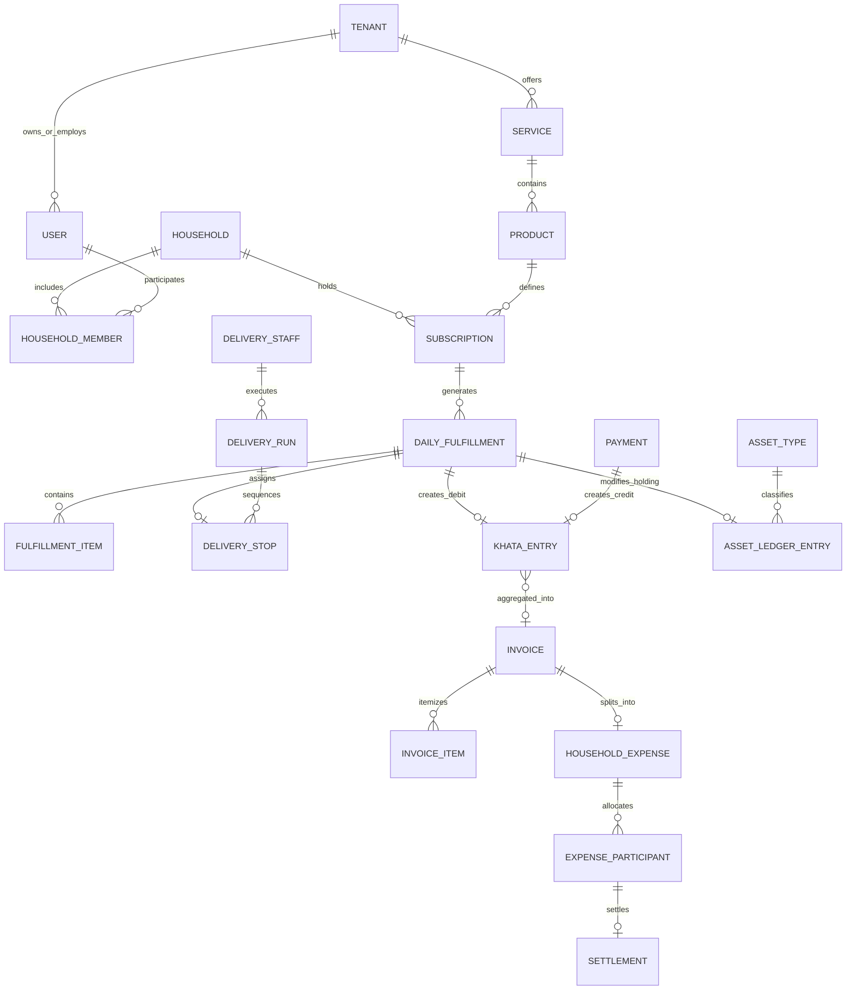

# Conceptual Data Model: Entities & Invariants

**Classification:** `[CONFIRMED PRODUCT REQUIREMENT]`

---

## 1. Entity-Relationship Overview

---

## 2. Core Entity Catalog

### 2.1 Identity & Multi-Tenancy Entities

#### `Tenant` (Vendor Business)
* **Purpose:** The multi-tenant root representing a local business (e.g., *Sharma Tiffin Services*).
* **Fields:** `id`, `business_name`, `slug`, `phone`, `email`, `address_json`, `upi_id`, `plan_tier` (`STARTER` | `GROWTH` | `PRO`), `fssai_number`, `gstin`, `status`, `created_at`.
* **Invariants:** Every operational entity (products, fulfillments, khata, staff) MUST possess an immutable foreign key `tenant_id`.

#### `User`
* **Purpose:** Any authenticated individual across any role (customer, vendor admin, driver, platform staff).
* **Fields:** `id`, `phone_number` (Unique E.164), `full_name`, `email`, `role`, `status`, `whatsapp_opt_in`, `created_at`.

#### `Household` & `HouseholdMember`
* **Purpose:** The domestic dwelling unit consuming shared services.
* **Fields (`Household`):** `id`, `name`, `primary_owner_id`, `society_name`, `tower_wing`, `floor`, `flat_number`, `coordinates_json`, `created_at`.
* **Fields (`HouseholdMember`):** `id`, `household_id`, `user_id`, `role` (`PRIMARY_OWNER`, `MEMBER`), `permissions_json`.

---

### 2.2 Catalog & Operations Entities

#### `Service` & `Product`
* **Fields (`Service`):** `id`, `tenant_id`, `category` (`TIFFIN`, `WATER`, `MILK`, etc.), `name`, `cutoff_policy_json`, `is_active`.
* **Fields (`Product`):** `id`, `tenant_id`, `service_id`, `name`, `base_price_paise`, `unit_type` (`MEAL`, `LITER`, `JAR`), `is_addon`, `is_active`.

#### `Subscription` & `SubscriptionSchedule`
* **Fields (`Subscription`):** `id`, `tenant_id`, `household_id`, `customer_id`, `product_id`, `cadence_type`, `default_quantity`, `status`, `autopilot_default`, `start_date`, `end_date`.
* **Fields (`SubscriptionSchedule`):** `id`, `subscription_id`, `day_of_week`, `scheduled_quantity`, `shift`.

#### `DailyFulfillment` & `FulfillmentItem`
* **Fields (`DailyFulfillment`):** `id`, `tenant_id`, `subscription_id`, `customer_id`, `service_date`, `shift`, `status`, `cutoff_time`, `delivered_at`, `total_charge_paise`, `khata_entry_id`.
* **Fields (`FulfillmentItem`):** `id`, `fulfillment_id`, `product_id`, `quantity`, `unit_price_paise`, `total_paise`.
* **Invariant:** Price snapshots MUST be frozen in `FulfillmentItem` at creation time.

---

### 2.3 Field Delivery Entities

#### `DeliveryStaff`
* **Fields:** `id`, `tenant_id`, `user_id`, `vehicle_type`, `assigned_zones_json`, `is_active`.

#### `DeliveryRun` & `DeliveryStop`
* **Fields (`DeliveryRun`):** `id`, `tenant_id`, `driver_id`, `shift`, `run_date`, `status` (`ASSIGNED`, `IN_PROGRESS`, `COMPLETED`).
* **Fields (`DeliveryStop`):** `id`, `delivery_run_id`, `fulfillment_id`, `sequence_order`, `status`, `assets_delivered`, `assets_collected`, `proof_url`.

---

### 2.4 Financial & Ledger Entities

#### `KhataEntry` (The Financial Source of Truth)
* **Fields:** `id`, `tenant_id`, `customer_id`, `household_id`, `entry_type`, `direction` (`DEBIT` | `CREDIT`), `amount_paise`, `running_balance_paise`, `reference_type`, `reference_id`, `description`, `created_at`.
* **Invariant:** Strictly append-only. Zero SQL updates or deletes permitted.

#### `Invoice` & `InvoiceItem`
* **Fields (`Invoice`):** `id`, `tenant_id`, `customer_id`, `household_id`, `invoice_number`, `period_start`, `period_end`, `due_date`, `subtotal_paise`, `discount_paise`, `tax_paise`, `total_amount_due_paise`, `amount_paid_paise`, `status`.
* **Fields (`InvoiceItem`):** `id`, `invoice_id`, `product_name`, `quantity`, `unit_price_paise`, `total_paise`.

#### `Payment` & `PaymentAttempt`
* **Fields (`Payment`):** `id`, `tenant_id`, `customer_id`, `invoice_id`, `amount_paise`, `method` (`UPI_INTENT`, `CASH`), `status`, `gateway_order_id`, `bank_utr`, `khata_entry_id`, `settled_at`.

---

### 2.5 Physical Asset Entities

#### `AssetType` & `AssetLedgerEntry`
* **Fields (`AssetType`):** `id`, `tenant_id`, `name`, `unit_deposit_paise`, `replacement_cost_paise`, `max_holding`.
* **Fields (`AssetLedgerEntry`):** `id`, `tenant_id`, `customer_id`, `asset_type_id`, `fulfillment_id`, `action`, `quantity_delta`, `resulting_holding_count`, `created_at`.

---

### 2.6 Expense Splitting & Disputes

#### `HouseholdExpense` & `ExpenseParticipant`
* **Fields (`HouseholdExpense`):** `id`, `household_id`, `source_invoice_id`, `paid_by_user_id`, `total_amount_paise`, `split_strategy`, `status`.
* **Fields (`ExpenseParticipant`):** `id`, `expense_id`, `user_id`, `allocated_amount_paise`, `is_settled`.

#### `Dispute`
* **Fields:** `id`, `tenant_id`, `customer_id`, `fulfillment_id`, `khata_entry_id`, `category`, `status`, `refund_amount_paise`, `resolution_notes`, `resolved_at`.
