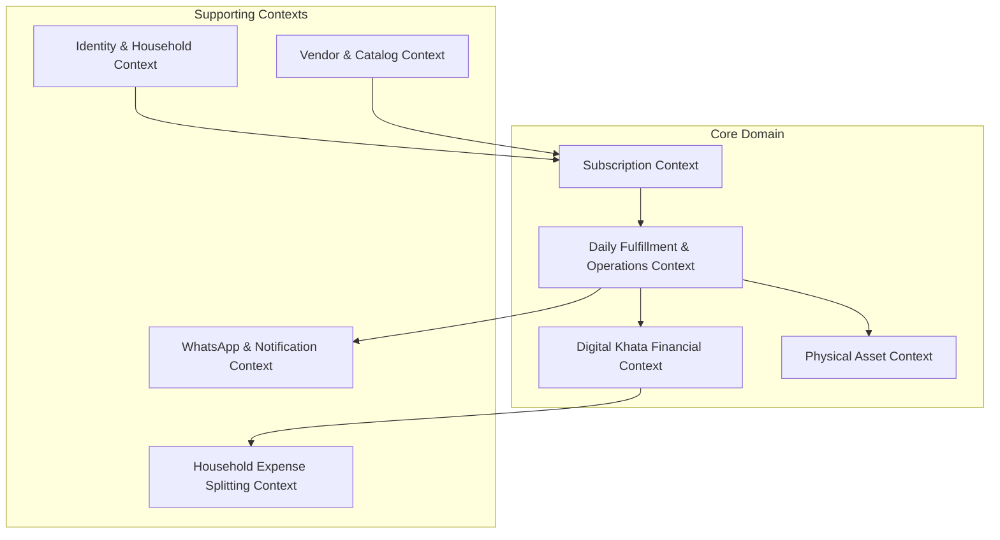

# Domain Model: Bounded Contexts & Aggregates

**Classification:** `[CONFIRMED PRODUCT REQUIREMENT]`

---

## 1. Bounded Context Map

Following Domain-Driven Design (DDD), RUXS partitions hyper-local household operations into eight distinct **Bounded Contexts**:

---

## 2. Bounded Context Definitions & Aggregates

### 2.1 Identity & Household Context
* **Root Aggregate:** `Household`
* **Entities & Value Objects:** `User`, `HouseholdMember`, `Address`, `ContactVerification`.
* **Ubiquitous Language:** *Primary Owner, Roommate Member, Flat Coordinate, Gate Code.*
* **Boundary:** Manages human accounts, authentication credentials, physical domestic locations, and co-living relationships.

### 2.2 Vendor & Catalog Context
* **Root Aggregate:** `Vendor`
* **Entities & Value Objects:** `VendorMember`, `ServiceCategory`, `Product`, `CutoffPolicy`, `ShiftSchedule`.
* **Ubiquitous Language:** *Tenant, Shift, Preparation Cutoff, Service SKU, Base Unit.*
* **Boundary:** Defines what goods and services are offered, pricing models, daily operational cutoffs, and vendor staff rosters.

### 2.3 Subscription Context
* **Root Aggregate:** `Subscription`
* **Entities & Value Objects:** `SubscriptionSchedule`, `VacationPause`, `QuantityModifier`.
* **Ubiquitous Language:** *Cadence, Autopilot Default, Active Run, Temporary Hold.*
* **Boundary:** Models the ongoing, recurring commercial agreement between a household and a vendor.

### 2.4 Daily Fulfillment & Operations Context
* **Root Aggregate:** `DailyFulfillment`
* **Entities & Value Objects:** `FulfillmentItem`, `DeliveryRun`, `DeliveryStop`, `DeliveryVerificationRecord`.
* **Ubiquitous Language:** *Scheduled Unit, Kitchen Batch Counter, Doorstep Drop, Run Sheet, Proof Geostamp.*
* **Boundary:** Manages the concrete physical execution of a service on a specific date, enforcing cutoff locks and driver assignments.

### 2.5 Physical Asset Context
* **Root Aggregate:** `CustomerAssetBalance`
* **Entities & Value Objects:** `AssetType`, `AssetLedgerEntry`, `DepositLiability`.
* **Ubiquitous Language:** *Bubble-top Can, Stainless Dabba, Empty Swap, Holding Balance, Deposit Forfeiture.*
* **Boundary:** Tracks circulating physical containers, swaps at doorstep, and security deposits.

### 2.6 Digital Khata & Billing Context
* **Root Aggregate:** `KhataAccount`
* **Entities & Value Objects:** `KhataEntry`, `Invoice`, `InvoiceItem`, `Payment`, `DisputeRecord`.
* **Ubiquitous Language:** *Paise, Append-Only Transaction, Running Balance, Statement, UPI UTR, Reconciliation.*
* **Boundary:** Guarantees double-entry ledger math, monthly invoicing, payment ingestion, and dispute arbitration.

### 2.7 Household Expense Sharing Context (Phase 5)
* **Root Aggregate:** `HouseholdExpense`
* **Entities & Value Objects:** `ExpenseParticipant`, `DebtAllocation`, `PeerSettlement`.
* **Ubiquitous Language:** *Flatmate Share, Equal Split, P2P UPI Reimbursement.*
* **Boundary:** Manages internal roommate debt allocation on top of cleared vendor invoices.

### 2.8 Communication Context
* **Root Aggregate:** `ConversationThread`
* **Entities & Value Objects:** `NotificationLog`, `WhatsAppTemplate`, `InteractiveActionPayload`.
* **Ubiquitous Language:** *Utility Template, Quick Reply Button, Delivery Webhook, DLT Route.*
* **Boundary:** Mediates all inbound and outbound messaging across Meta WhatsApp API, SMS gateways, and Web Push.
