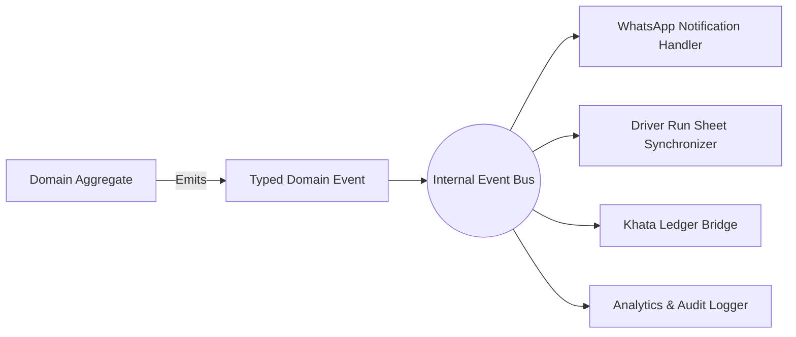

# Architecture Specification: Domain Events Catalog

**Classification:** `[CONFIRMED PRODUCT REQUIREMENT]`

---

## 1. Event-Driven Architecture Overview

All side effects in RUXS (sending WhatsApp messages, updating driver run sheets, logging audit entries, recalculating balances) are driven by strongly typed **Domain Events**.

Events are published to an internal event bus (powered by Redis Streams or Cloudflare Queues) immediately following the successful commit of a database transaction.



---

## 2. Master Domain Event Catalog

| Event Name | Aggregate Root | Trigger Condition | Primary Listeners / Side Effects |
| :--- | :--- | :--- | :--- |
| `SubscriptionCreated` | `Subscription` | Customer/Vendor activates contract | Initialize first month's schedule; send welcome WhatsApp. |
| `SubscriptionPaused` | `Subscription` | Vacation mode activated | Cancel scheduled fulfillments in date range; notify vendor. |
| `DailyFulfillmentScheduled` | `DailyFulfillment` | Midnight cron generator runs | Queue morning polling job in Redis. |
| `FulfillmentPollDispatched` | `DailyFulfillment` | WhatsApp message sent to user | Update fulfillment state to `CONFIRMATION_REQUIRED`. |
| `CustomerConfirmedFulfillment`| `DailyFulfillment` | User taps [DELIVER] button | Transition state to `CONFIRMED`; increment live kitchen counter. |
| `CustomerSkippedFulfillment` | `DailyFulfillment` | User taps [SKIP] before cutoff| Transition state to `SKIPPED`; decrement live kitchen counter. |
| `CustomerLateSkipRequested` | `DailyFulfillment` | User taps [SKIP] after cutoff | Transition to `LATE_SKIP`; apply late cancellation fee to Khata. |
| `CutoffWindowLocked` | `CutoffPolicy` | Cutoff time reached | Auto-confirm unresponded orders; freeze kitchen batch counts. |
| `OrderDispatchedToDriver` | `DeliveryRun` | Driver assigned run sheet | Generate mobile sequence; notify customer *"Order on the way"*. |
| `OrderDelivered` | `DailyFulfillment` | Driver marks drop completed | **Append `FULFILLMENT_DEBIT` to Khata**; update Asset Ledger. |
| `OrderDeliveryFailed` | `DailyFulfillment` | Driver marks failure | Notify vendor admin; trigger customer contact workflow. |
| `AssetExchangeRecorded` | `CustomerAssetBalance`| Empty dabba/can swapped at door| Update customer asset holding balance; audit container inventory.|
| `KhataDebited` | `KhataAccount` | Delivery or fee appended | Recalculate customer running balance; check credit limit. |
| `InvoiceGenerated` | `Invoice` | 1st of month billing cron | Dispatch monthly statement & UPI payment link on WhatsApp. |
| `PaymentSucceeded` | `Payment` | Gateway webhook verified | **Append `PAYMENT_CREDIT` to Khata**; mark invoice `PAID`. |
| `DisputeOpened` | `Dispute` | Customer contests delivery | Flag Khata debit; alert vendor admin dashboard for review. |
| `DisputeResolved` | `Dispute` | Vendor/Admin decides claim | Append `DISPUTE_REFUND` credit if upheld; notify customer. |

---

## 3. Standard Event Envelope Schema

```typescript
interface DomainEvent<T = Record<string, any>> {
  event_id: string;                   // UUID v4
  event_name: string;                 // e.g., "OrderDelivered"
  occurred_at: Date;                  // UTC Timestamp
  tenant_id: string;                  // Multi-tenant isolation key
  actor: {
    user_id?: string;
    role: "SYSTEM" | "CUSTOMER" | "VENDOR_ADMIN" | "DELIVERY_STAFF";
    ip_address?: string;
  };
  aggregate: {
    type: "SUBSCRIPTION" | "FULFILLMENT" | "KHATA" | "PAYMENT" | "ASSET";
    id: string;
  };
  payload: T;                         // Event-specific data
}
```
