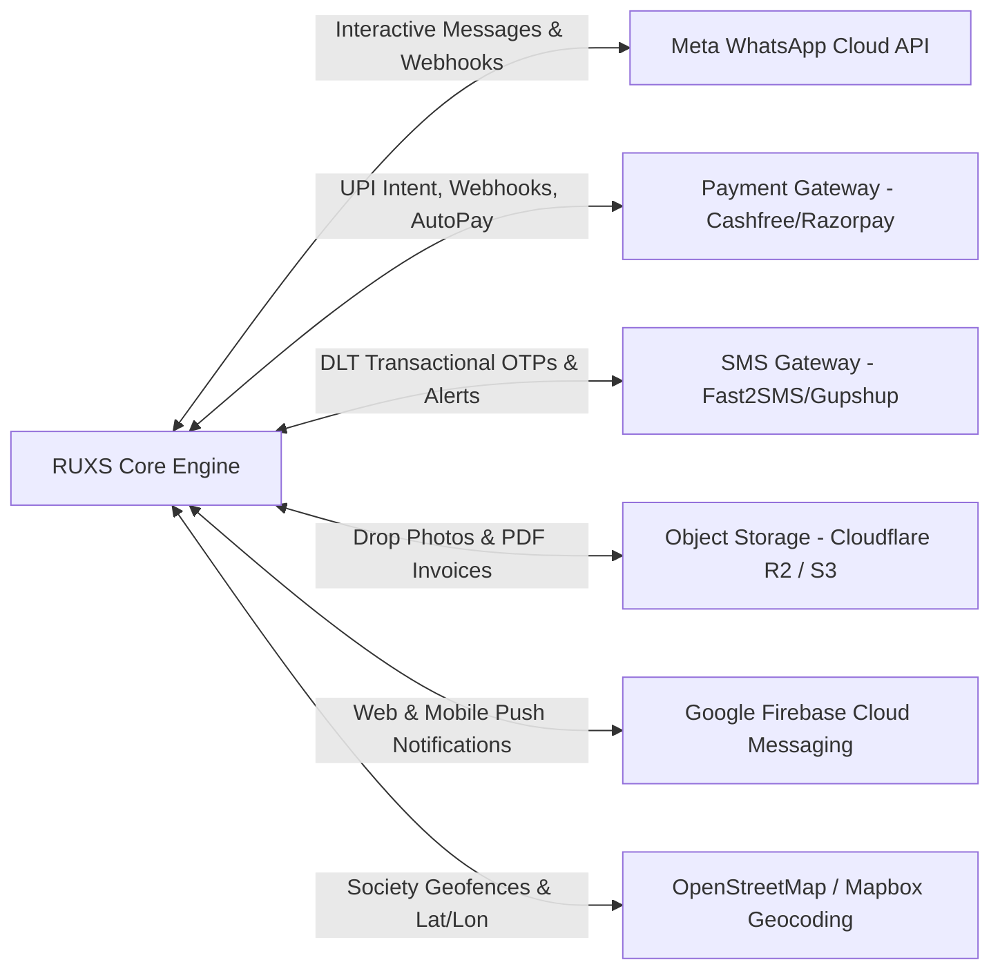

# Architecture Specification: External Integrations & Gateways

**Classification:** `[CONFIRMED PRODUCT REQUIREMENT]`

---

## 1. External System Interface Map

RUXS bridges hyper-local physical operations with external enterprise APIs across five functional categories:

---

## 2. Integration Catalog & Contracts

### 2.1 Meta WhatsApp Cloud API
* **Purpose:** Primary conversational interaction surface for consumers.
* **Authentication:** System-User Bearer Token over HTTPS; Webhook validation via `X-Hub-Signature-256`.
* **Endpoints Used:**
  * Outbound: `POST /v20.0/{phone_number_id}/messages`
  * Inbound Webhook: `POST /api/webhooks/whatsapp`
* **Failure Mode:** Circuit break after 5 consecutive 5xx errors; divert to SMS fallback queue.

### 2.2 Payment Gateway (UPI-First)
* **Purpose:** Collection of monthly statements and customer deposits.
* **Authentication:** API Key & Secret (HMAC SHA-256 webhook signature verification).
* **Endpoints Used:**
  * Create Order: `POST /orders` (Retrieves UPI deep-link URL and QR payload)
  * Webhook Ingestion: `POST /api/webhooks/payments`
  * Settlement Inquiry: `GET /orders/{order_id}`
* **Provider Abstraction:** Implemented behind `PaymentGatewayAdapter` to permit seamless hot-swapping between Cashfree, Razorpay, and PhonePe PG.

### 2.3 Indian DLT SMS Gateway
* **Purpose:** Critical OTP fallback and legal delivery notices when WhatsApp is unreachable.
* **Compliance:** Strict compliance with Telecom Regulatory Authority of India (TRAI) Distributed Ledger Technology (DLT) regulations.
* **Format:** Requires registered Entity ID, Header ID, and Template IDs.

### 2.4 Cloudflare R2 / S3 Object Storage
* **Purpose:** Cost-effective, zero-egress storage for user-uploaded delivery drop photos and auto-generated monthly invoice PDFs.
* **Access Control:** Files uploaded via short-lived pre-signed URLs (`PUT`); public access is blocked; authenticated proxy streaming for customer downloads.
