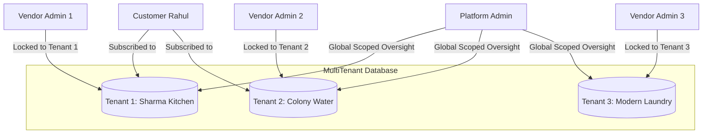

# Architecture Specification: Multi-Tenancy & Tenant Isolation

**Classification:** `[CONFIRMED PRODUCT REQUIREMENT]`

---

## 1. Multi-Tenant Philosophy

In RUXS, a **Tenant** is a distinct, independent local business (e.g., *Sharma Tiffin Kitchen*, *Colony Aqua Waters*, *Amrit Cow Milk*).

Vendors often operate in close geographic proximity, sometimes even serving the exact same apartment buildings. It is a **P0 security and commercial mandate** that:
* Vendor A can NEVER view Vendor B's customer roster, sales volume, menu pricing, Khata ledgers, or delivery routes.
* Customers can subscribe to multiple independent vendors simultaneously, maintaining clean, isolated relationships with each.



---

## 2. Multi-Tenancy Architecture Patterns Evaluated

| Tenancy Model | Description | Pros | Cons | Decision for RUXS |
| :--- | :--- | :--- | :--- | :--- |
| **Separate DB per Tenant** | Every vendor gets their own PostgreSQL database. | Absolute physical isolation. | Unmanageable connection pooling, migration nightmare for 1,000+ vendors. | ❌ Rejected |
| **Separate Schema per Tenant**| Shared database, isolated PostgreSQL schemas (`sharma.*`, `aqua.*`). | Strong logical isolation. | Schema migration complexity, connection overhead. | ❌ Rejected |
| **Pooled Relational with Row-Level Security (RLS)** | Shared database & tables with mandatory `tenant_id` column and DB-level RLS policies. | Highly cost-effective, seamless migrations, fast cross-vendor consumer views. | Requires strict discipline in SQL query filtering. | **✅ SELECTED (Industry Standard)** |

---

## 3. Implementation Blueprint: PostgreSQL Row-Level Security (RLS)

To guarantee that application-layer programming errors cannot leak cross-tenant data:

```sql
-- 1. Enable RLS on core tables
ALTER TABLE daily_fulfillments ENABLE ROW LEVEL SECURITY;
ALTER TABLE khata_entries ENABLE ROW LEVEL SECURITY;
ALTER TABLE invoices ENABLE ROW LEVEL SECURITY;

-- 2. Define Tenant Isolation Policy for Vendor Admins & Staff
CREATE POLICY vendor_tenant_isolation_policy ON daily_fulfillments
    FOR ALL
    USING (
        tenant_id = NULLIF(current_setting('app.current_tenant_id', true), '')::uuid
        OR current_setting('app.user_role', true) = 'PLATFORM_ADMIN'
    );

-- 3. Define Customer Isolation Policy
CREATE POLICY customer_isolation_policy ON daily_fulfillments
    FOR SELECT
    USING (
        customer_id = NULLIF(current_setting('app.current_user_id', true), '')::uuid
    );
```

### Context Injection on Database Connections
Every database query in the Next.js service layer executes within a transaction that sets local session variables:
```typescript
await db.transaction(async (tx) => {
  await tx.execute(sql`SET LOCAL app.current_tenant_id = ${session.tenantId}`);
  await tx.execute(sql`SET LOCAL app.current_user_id = ${session.userId}`);
  await tx.execute(sql`SET LOCAL app.user_role = ${session.role}`);
  
  // Safe scoped business query
  return await tx.query.dailyFulfillments.findMany({...});
});
```

---

## 4. Multi-Tenant Cross-Contamination Testing

Automated end-to-end and integration test suites must include negative assertion suites:
* Test `TC-SEC-01`: Vendor A attempts to read `GET /api/v1/customers/:id` where customer belongs exclusively to Vendor B. Expected: `HTTP 404 Not Found` or `403 Forbidden`.
* Test `TC-SEC-02`: Vendor A issues a Khata debit targeting Vendor B's customer. Expected: Transaction rolled back with `TenantMismatchException`.
