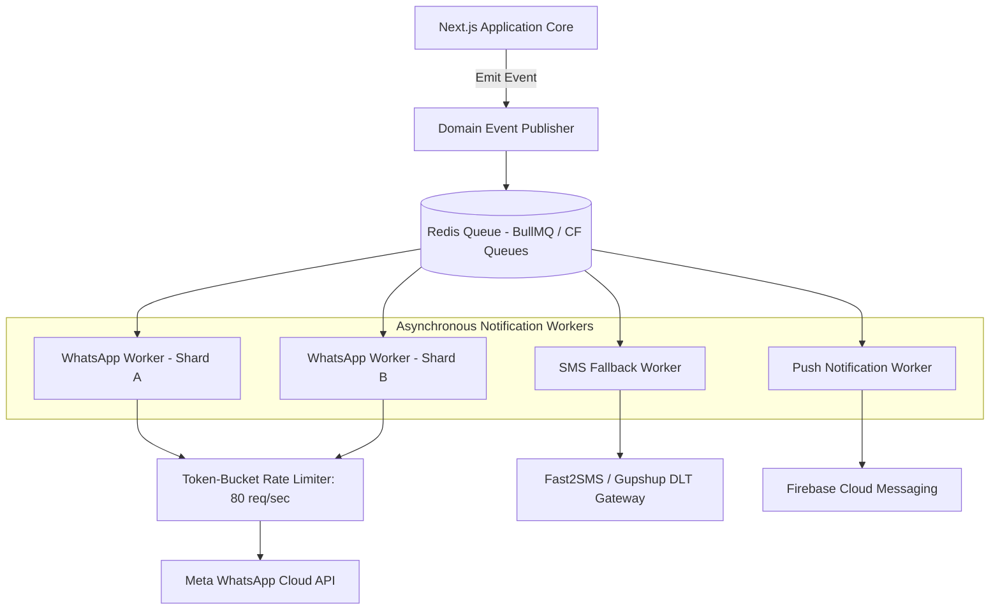

# Architecture Specification: Notification Infrastructure & Gateways

**Classification:** `[CONFIRMED PRODUCT REQUIREMENT]`

---

## 1. Technical Topology

The Notification Infrastructure handles high-burst outbound messaging (e.g., dispatching 5,000 morning WhatsApp polls simultaneously at 8:30 AM across multiple vendors) while respecting strict external API rate limits.



---

## 2. Meta WhatsApp Cloud API Integration Constraints

* **Throughput Limits:** Default Meta Cloud API tier permits **80 messages per second** per WhatsApp Business Account (WABA).
* **Burst Management:** The Redis queue buffers and meters morning poll jobs, preventing HTTP 429 `rate_limit_exceeded` errors from Meta.
* **Concurrency Locks:** A distributed lock per recipient phone number ensures that multiple workers do not send overlapping messages to the same user simultaneously.

---

## 3. Template Pre-Registration & Versioning

All outbound WhatsApp messages must use pre-approved Meta message templates:

```typescript
interface RegisteredTemplate {
  template_name: string;              // e.g. "ruxs_daily_poll_v1"
  language: "en" | "hi";
  category: "UTILITY";
  components: {
    type: "BODY" | "BUTTONS";
    parameters: {
      type: "text" | "payload";
      value: string;
    }[];
  }[];
}
```

* **Zero Custom Promotional Text:** Outbound messages sent outside the 24-hour customer care window must strictly conform to approved `UTILITY` templates to maintain business number quality scores.
