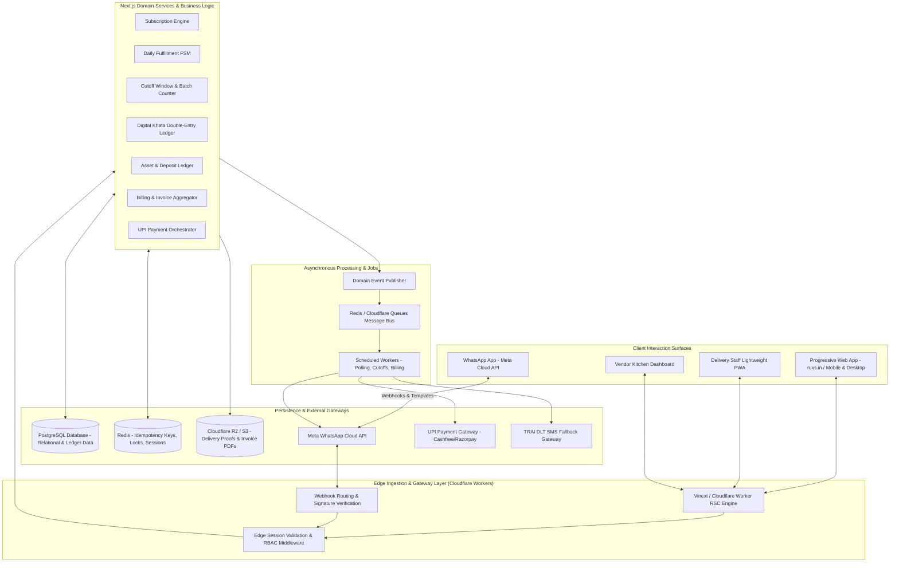

# System Architecture Overview: RUXS

**Brand:** RUXS (`ruxs.in`)  
**Classification:** `[CONFIRMED PRODUCT REQUIREMENT]`

---

## 1. High-Level Architectural Topology

RUXS is designed as an edge-capable, highly available, event-driven web application built on modern Next.js and Cloudflare Workers architecture.

---

## 2. Component Layer Responsibilities

### 2.1 Edge & Ingestion Layer
* **Cloudflare Workers & Vinext:** Renders React Server Components (RSC) with ultra-low latency from regional edge nodes across India (Mumbai, Chennai, Bangalore, Delhi, Hyderabad).
* **Webhook Receiver:** Ingests high-concurrency callbacks from Meta and payment gateways, verifies cryptographic signatures in <15ms, checks Redis idempotency caches, and returns HTTP 200 before queuing domain work.

### 2.2 Domain Application Core
* Modular business logic adhering to Domain-Driven Design (DDD) principles.
* Encapsulates state machines (Fulfillment, Cutoffs, Payments) with strict transition guards.
* Enforces tenant isolation and transaction boundaries.

### 2.3 Persistence & Storage
* **Primary Relational Store (PostgreSQL):** Stores relational entities, customer profiles, subscriptions, and the append-only `khata_entries` ledger.
* **In-Memory Cache (Redis):** Distributed locks for concurrent fulfillment actions, webhook idempotency keys (TTL 24 hours), and session tokens.
* **Object Store (Cloudflare R2 / S3):** Geotagged drop photos, verification snapshots, and generated PDF invoice statements.

### 2.4 Asynchronous Worker Subsystem
* Executes time-sensitive operations without blocking user request threads:
  * Morning WhatsApp Polling (06:00 AM–08:30 AM).
  * Cutoff Locking & Kitchen Production Aggregation (09:00 AM–10:00 AM).
  * Monthly Invoice Aggregation (1st of month at 00:01 AM).
  * Webhook retries and failed message rerouting.
