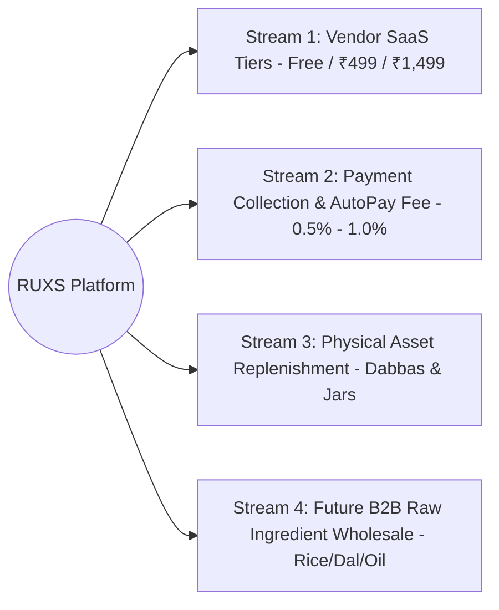

# Business Model & Monetization Strategy: RUXS

**Brand:** RUXS (`ruxs.in`)  
**Classification:** `[PROPOSED DESIGN & BUSINESS ASSUMPTIONS]`

---

## 1. The Core Monetization Philosophy

RUXS does not monetize by imposing painful 20% to 30% take-rates on low-margin local foods, nor by marking up local milk pouches. 

Instead, RUXS operates on a **High-Velocity Hybrid SaaS & Operational Infrastructure Model**:
1. **Vendor SaaS Subscriptions:** Predictable recurring software revenue paid by vendors for daily coordination, automated cutoffs, and digital run sheets.
2. **Payment Collection Infrastructure:** Micro-take rate (or flat fee) on consolidated monthly UPI digital collections.
3. **Upstream B2B Procurement Marketplace (Future):** Aggregating network purchasing power for food packaging, stainless steel dabbas, 20L jars, and staple ingredients.

---

## 2. Revenue Streams Breakdown

### Stream 1: Vendor Tiered SaaS Subscriptions (Primary)
* Local vendors subscribe to RUXS monthly to run their daily business operations.
* Free starter tier acts as an unbeatable zero-friction acquisition funnel.
* Scaling businesses naturally upgrade to paid tiers as their subscriber rosters expand.

### Stream 2: Digital Payment Collection Fee (Secondary)
* For vendors processing collections through RUXS integrated UPI payment links:
  * Platform charges a nominal **0.5% to 1.0%** collection fee or flat ₹5 per cleared monthly invoice.
  * In exchange, vendors get instant auto-reconciliation, WhatsApp receipt dispatch, and automated overdue reminder sequences.

### Stream 3: Returnable Asset Supply & Replenishment
* Standardized, high-durability food-grade 4-tier steel tiffins and certified BPA-free 20L polycarbonate bubble-top cans branded with RUXS asset QR codes sold directly to network vendors at volume wholesale pricing.

### Stream 4: Upstream B2B Group Procurement (Phase 6)
* When 50 tiffin kitchens in Bangalore cook for 5,000 subscribers, RUXS aggregates demand for staple commodities (basmati rice, sunflower oil, wheat flour, gas cylinders), purchasing directly from mills at 12–18% below retail mandi prices.
