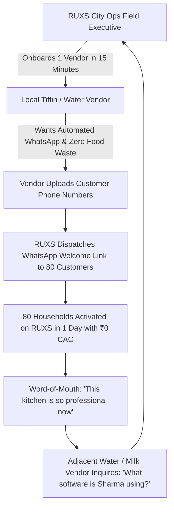

# Go-To-Market (GTM) Strategy: RUXS

**Brand:** RUXS (`ruxs.in`)  
**Classification:** `[PROPOSED DESIGN]`

---

## 1. The Trojan Horse: Vendor-Led Customer Acquisition

Traditional consumer platforms burn venture capital acquiring consumers through Facebook ads and discount coupons, only to face high churn.

**RUXS turns this dynamic upside down through Vendor-Led Zero-CAC Onboarding:**

---

## 2. The Hyper-Local Density Playbook (The 3km Cluster)

RUXS does not launch across an entire city at once. We achieve total operational dominance within a **3-square-kilometer high-density cluster** before expanding:

### Target Cluster Characteristics
1. **High Young Professional & Student Density:** 1BHK/2BHK apartment complexes, PG accommodations, co-living buildings.
2. **Dense Local Service Ecosystem:** 10+ active tiffin home-chefs, 3 local water bottling depots, 2 milk booths delivering to the same societies.
3. **Primary Beachhead Locations:**
   * **Bangalore:** HSR Layout (Sectors 1, 2, 3) / BTM Layout / Koramangala.
   * **Pune:** Kothrud / Viman Nagar / Wakad.
   * **Gurgaon:** DLF Phase 3 / Sector 43 / Sector 56.

---

## 3. The 15-Minute Vendor Onboarding Playbook

A dedicated field operations representative visits the vendor kitchen during the afternoon lull (2:30 PM–4:00 PM):

* **Minute 0–3: The Pitch:** Show Sharma-ji how the system eliminates unread WhatsApp messages and prevents cooking meals that will be cancelled.
* **Minute 4–8: Setup Profile:** Enter business name, address, UPI ID for receiving payments, and configure 10:00 AM cutoff.
* **Minute 9–12: Import Customers:** Take a photo of the vendor's paper notebook or export contacts from the vendor's WhatsApp chat list.
* **Minute 13–15: The First Test Poll:** Send a live interactive WhatsApp poll to Sharma-ji's own phone. He taps `[DELIVER]` and watches his screen live counter increment.
* **The "Aha!" Moment:** The vendor realizes they will never have to spend 2 hours reconciling WhatsApp messages again.

---

## 4. Viral Cross-Pollination Inside Gated Communities

Once 50 residents inside *Green Glen Apartments* experience RUXS through their tiffin provider:
1. Residents expect the same 1-tap WhatsApp cutoff experience from their water supplier.
2. Residents recommend RUXS to their colony water delivery boy: *"Bhaiya, use RUXS like Sharma Kitchen does, so we can see our jar balance on WhatsApp."*
3. The water vendor adopts RUXS to retain customers, expanding RUXS from a single service into the default domestic operating system of that apartment society.
