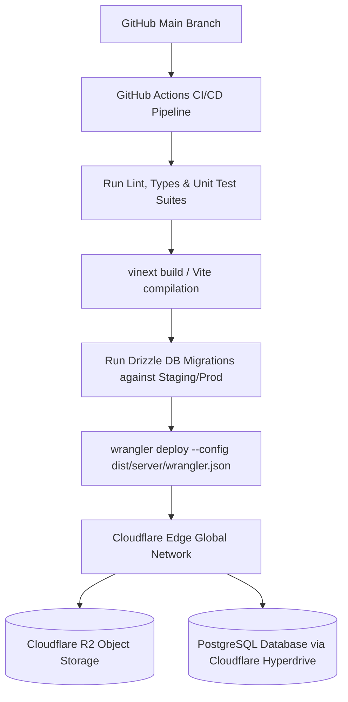

# Deployment & Infrastructure Guide: RUXS

**Classification:** `[CONFIRMED ENGINEERING DIRECTIVE]`

---

## 1. Infrastructure Topology: Cloudflare Edge + Managed Postgres

RUXS is deployed as a globally distributed, edge-rendered application on the Cloudflare Workers platform:



---

## 2. Environments & Configurations

| Environment | Primary URL | Cloudflare Worker Script | Database Instance |
| :--- | :--- | :--- | :--- |
| **Development** | `http://localhost:3000` | Local Vinext dev server | Local Docker PostgreSQL / Neon Branch |
| **Staging** | `https://staging.ruxs.in` | `ruxs-staging` | Neon Isolated Staging Branch |
| **Production** | `https://ruxs.in` | `ruxs` | High-Availability Managed PostgreSQL |

---

## 3. Environment Variables & Secrets Management

Secrets must **never** be committed to Git. In Cloudflare Workers, runtime secrets are injected via Wrangler CLI:

```bash
# Production Secrets Configuration
wrangler secret put DATABASE_URL
wrangler secret put WHATSAPP_ACCESS_TOKEN
wrangler secret put WHATSAPP_APP_SECRET
wrangler secret put WHATSAPP_WEBHOOK_VERIFY_TOKEN
wrangler secret put PAYMENT_GATEWAY_API_KEY
wrangler secret put PAYMENT_GATEWAY_SECRET
wrangler secret put JWT_SIGNING_SECRET
```

### Required Non-Secret Variables (in `wrangler.jsonc`)
```jsonc
{
  "vars": {
    "APP_ENV": "production",
    "PRIMARY_DOMAIN": "ruxs.in",
    "DEFAULT_TIMEZONE": "Asia/Kolkata"
  }
}
```

---

## 4. Database Migrations Workflow

Migrations must be backward-compatible (Zero-Downtime Migration Pattern):
1. **Phase 1 (Add Column):** Add new nullable columns or tables via `bun drizzle-kit generate` and `bun drizzle-kit migrate`.
2. **Phase 2 (Deploy Code):** Deploy updated Cloudflare Workers code writing to both old and new columns.
3. **Phase 3 (Backfill & Contract):** Backfill historical rows and drop obsolete columns in a subsequent release.

---

## 5. Deployment Commands Reference

* **Start Local Development:**
  ```bash
  bun run dev
  ```
* **Compile Edge Production Build:**
  ```bash
  bun run build
  ```
* **Run Local Worker Preview:**
  ```bash
  bun run preview
  ```
* **Deploy to Production (Cloudflare Workers):**
  ```bash
  bun run deploy
  ```
