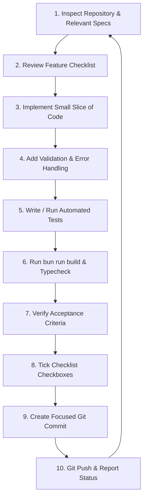

# Development Workflow & Execution Protocol: RUXS

**Classification:** `[CONFIRMED ENGINEERING DIRECTIVE]`

---

## 1. Incremental Step Execution Loop

Every implementation task in RUXS must follow this disciplined 10-step execution cycle:

---

## 2. Definition of Done (DoD)

A task is **NEVER** considered complete merely because a file was edited or a page renders.  
A task is **DONE** only when:
* [x] Requirements from the checklist are completely satisfied.
* [x] Schema/Database invariants are enforced.
* [x] Ingress data is validated using Zod.
* [x] Server-side authorization is verified.
* [x] Error states are handled gracefully.
* [x] Automated tests pass cleanly.
* [x] `bun run build` succeeds with zero errors.
* [x] Checklist item is ticked with commit hash.
* [x] Focused git commit is created and pushed.
