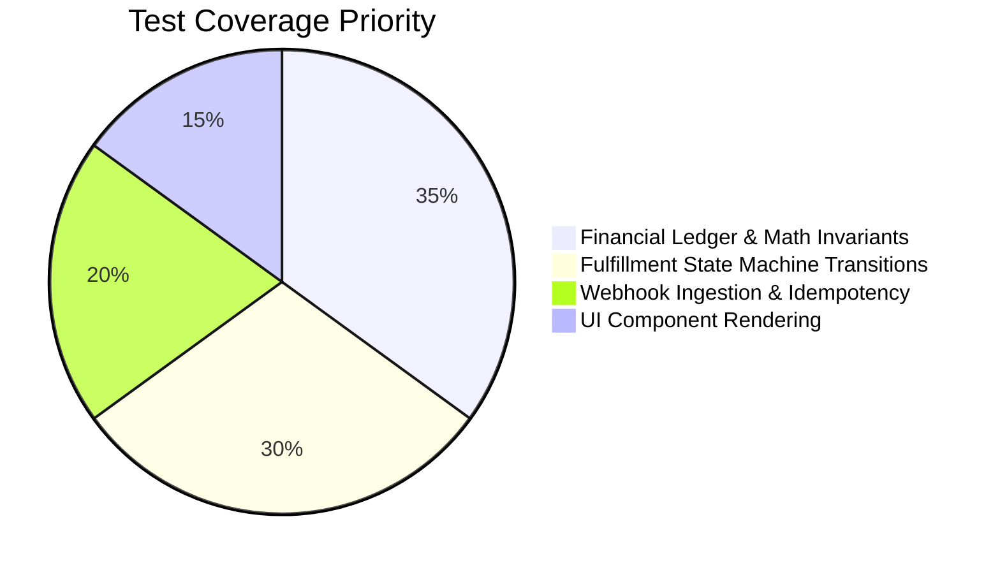

# Testing Strategy & Quality Assurance: RUXS

**Classification:** `[CONFIRMED ENGINEERING DIRECTIVE]`

---

## 1. Testing Pyramid & Philosophy

Because RUXS handles daily domestic food, water supplies, and real financial ledgers, testing focuses heavily on **state machine transitions, financial arithmetic, and concurrency guards**:

---

## 2. Critical Test Suites

### 2.1 Financial Ledger Invariant Tests
Every ledger transaction must be verified against double-entry mathematical invariants:
* **Running Balance Correctness:** The running balance recorded on transaction $N$ must equal the running balance on transaction $N-1$ plus or minus the current entry amount:
  $$\text{balance}_N = \text{balance}_{N-1} + \text{delta}_N$$
* **Zero Floating-Point Drift:** Tests executing 10,000 randomized micro-transactions must assert that integer Paise calculations yield zero cents/paise discrepancies.
* **Append-Only Immutability:** Tests must assert that attempting an `UPDATE` or `DELETE` SQL query on `khata_entries` raises a database exception.

### 2.2 Fulfillment State Machine Transition Tests
A comprehensive test matrix must execute all valid and invalid state transitions:
* Assert that transitioning `CONFIRMED` -> `SKIPPED` succeeds when `NOW() < cutoff_time`.
* Assert that transitioning `CONFIRMED` -> `SKIPPED` fails with `CutoffExceededError` when `NOW() >= cutoff_time`.
* Assert that an order cannot move directly from `SCHEDULED` to `DELIVERED` without passing through confirmation and prep.

### 2.3 Webhook Idempotency & Deduplication Tests
Simulate real-world network instability by firing the exact same webhook payload 10 times concurrently:
* Assert that exactly **one** database write occurs.
* Assert that all 10 HTTP requests receive `HTTP 200 OK`.
* Assert that zero duplicate Khata credits or duplicate delivery confirmations are generated.

### 2.4 Race Condition & Concurrency Tests
Simulate simultaneous customer skip at 09:59:59 AM and driver delivery checkoff:
* Assert that database row locks or optimistic concurrency version tokens reject the trailing transaction with a clean retry or failure error.
