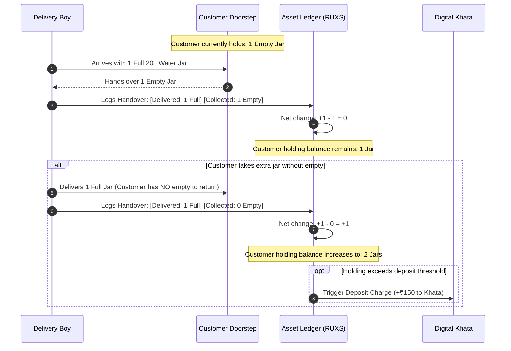
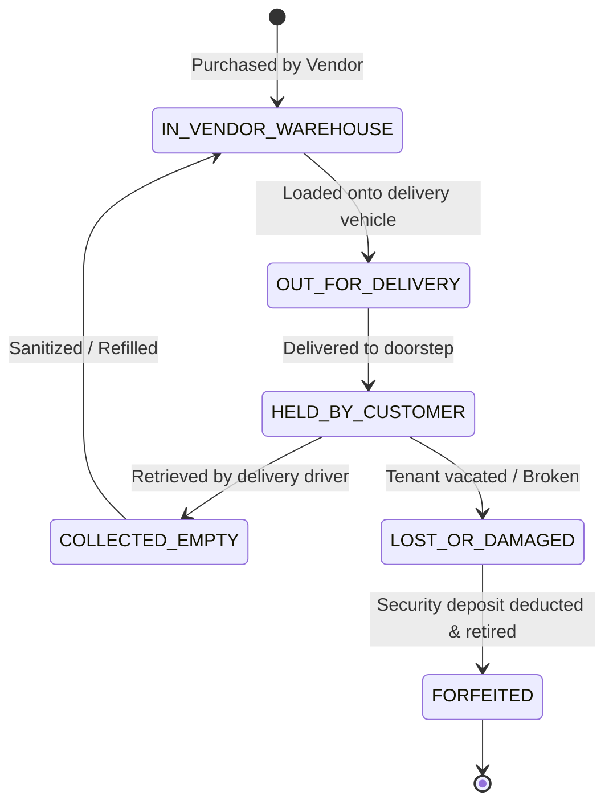

# Feature Specification: Physical Asset Ledger

**Classification:** `[CONFIRMED PRODUCT REQUIREMENT]`

---

## 1. Overview & Problem

In recurring physical services, the container itself represents a major working capital investment:
* A 20-liter food-grade polycarbonate water can costs the supplier **₹150 to ₹250**. A supplier with 400 customers has over **₹1,00,000** tied up in circulating plastic.
* A high-grade insulated 4-tier stainless steel tiffin dabba costs **₹350 to ₹600**.
* Heavy-duty canvas laundry bags and glass milk bottles incur ongoing replenishment costs.

Without digital tracking, **10% to 18% of returnable inventory is lost, damaged, or kept by shifting tenants each year**. The **Asset Ledger** tracks physical goods with the same transaction-level rigor as the financial Khata.

---

## 2. The Doorstep Asset Exchange Model



---

## 3. Asset Holding Calculations & Formula

For any customer $i$ and asset type $A$ at time $t$:

$$\text{Holding Balance}_t = \text{Holding Balance}_{t-1} + \text{Quantity Delivered}_t - \text{Quantity Collected}_t$$

### Thresholds & Deposit Liabilities
* **Base Allotment:** Number of containers allowed under the standard active deposit (e.g., 2 jars for a ₹300 deposit).
* **Holding Ceiling:** Maximum containers a customer can hold before delivery is blocked or an additional security deposit is automatically added to the Khata.
* **Return Due Window:** Alert triggered if a customer holds containers for >14 days without an active subscription.

---

## 4. Asset States & Lifecycle



---

## 5. Conceptual Schema: Asset and AssetLedgerEntry

```typescript
interface AssetType {
  id: string;
  tenant_id: string;
  name: string;                       // e.g., "20L Polycarbonate Water Jar", "4-Tier Steel Tiffin"
  unit_deposit_paise: number;         // e.g., 15000 (₹150.00)
  replacement_cost_paise: number;     // e.g., 22000 (₹220.00)
  max_allowed_holding: number;        // e.g., 3 units
}

interface CustomerAssetBalance {
  id: string;
  tenant_id: string;
  customer_id: string;
  asset_type_id: string;
  current_holding_count: number;      // e.g., 2 jars
  deposit_held_paise: number;         // e.g., 30000 (₹300.00)
  last_activity_date: Date;
}

interface AssetLedgerEntry {
  id: string;                         // UUID
  tenant_id: string;
  customer_id: string;
  asset_type_id: string;
  fulfillment_id?: string;            // Linked delivery
  delivery_staff_id?: string;
  
  action: 
    | "DELIVERED_FULL"                // Driver dropped full container (+N holding)
    | "COLLECTED_EMPTY"               // Driver took empty container (-M holding)
    | "INITIAL_DEPOSIT"               // Customer registered & paid deposit
    | "DEPOSIT_REFUNDED"              // Customer returned all empties upon exit
    | "MARKED_DAMAGED"                // Customer cracked jar / dented dabba
    | "MARKED_LOST"                   // Customer lost container during house shift
    | "AUDIT_RECONCILIATION";         // Vendor physical count correction

  quantity_delta: number;             // Signed integer (+1, -1, +2, etc.)
  resulting_holding_count: number;    // Snapshot of balance after transaction
  notes?: string;
  created_at: Date;
}
```

---

## 6. Exit Reconciliation & Deposit Refund Protocol

When a customer cancels their subscription:
1. System checks `CustomerAssetBalance.current_holding_count`.
2. **If Count > 0:**
   * An **Asset Return Run** is scheduled for the delivery staff to collect empties.
   * Final Khata deposit refund is frozen until driver marks `COLLECTED_EMPTY`.
3. **If Customer Fails to Return Assets (after 14 days):**
   * Vendor triggers `FORFEIT_DEPOSIT`.
   * Asset holding balance is reset to 0.
   * The security deposit on the Khata is permanently recognized as vendor asset sales revenue.
