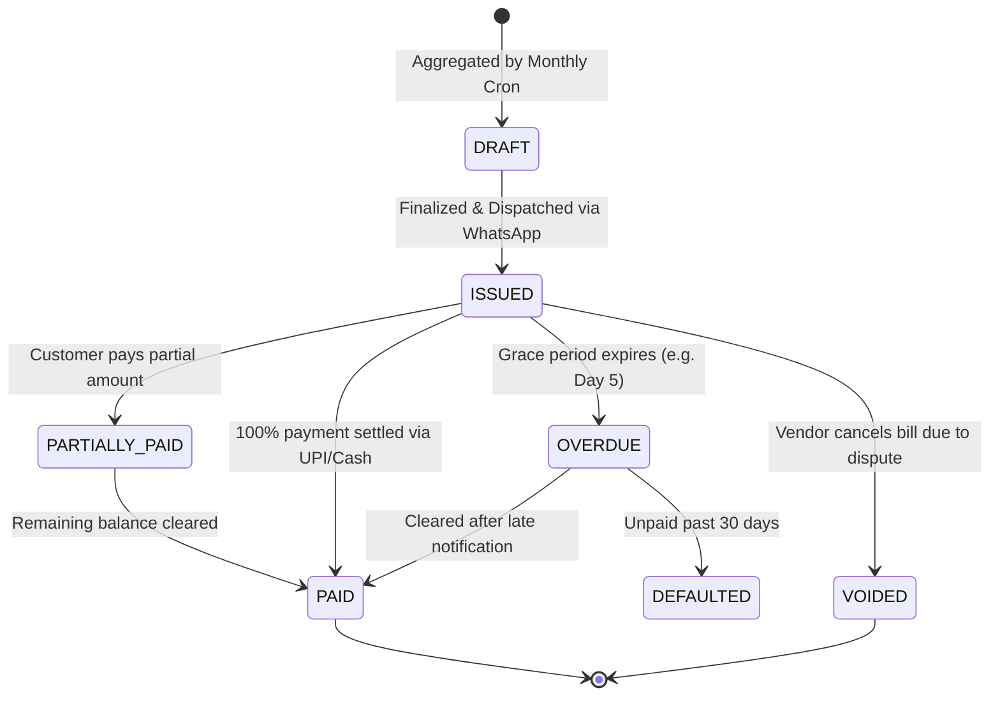

# Feature Specification: Consolidated Monthly Billing & Invoicing

**Classification:** `[CONFIRMED PRODUCT REQUIREMENT]`

---

## 1. Overview & Derivation Philosophy

In RUXS, an **Invoice is not an arbitrary bill created out of thin air**. It is a **deterministic, crystallized snapshot** derived directly from the unbilled debits and credits recorded in the customer's Digital Khata during the billing period.

On the 1st of every calendar month (or on a configured cycle date):
1. The **Billing Aggregator Worker** queries all unbilled `KhataEntry` records for the period.
2. Groups line items by service, product, and adjustment type.
3. Computes sub-totals, discounts, taxes (if vendor has GSTIN), and previous outstanding balances.
4. Generates an immutable `Invoice` entity with a unique reference number.
5. Emits an `InvoiceGenerated` event, triggering instant dispatch to the customer via WhatsApp and Web.

---

## 2. Sample Invoice Statement Structure

```
============================================================
                        RUXS STATEMENT                      
 Vendor: Sharma Tiffin & Dairy Services (GST: Optional)     
 Customer: Rahul Sharma (Flat 402, Oakwood Apts)            
 Period: 01 Oct 2026 to 31 Oct 2026 | Invoice: #INV-2026-10-842
============================================================

LINE ITEMS:
------------------------------------------------------------
1. Daily Homestyle Lunch
   22 Deliveries @ ₹100.00 ....................... ₹2,200.00
   (09 Days Skipped - Verified ₹0 Charge)

2. Morning Cow Milk (1.0L)
   28 Deliveries @ ₹40.00 ........................ ₹1,120.00
   (03 Days Skipped)

3. 20L RO Water Jars
   06 Jars Delivered @ ₹60.00 ....................   ₹360.00
   (Holding Balance: 2 Jars | Deposit: ₹300 Held)

4. Add-ons & Extra Rotis
   05 Add-on Events ..............................   ₹100.00

ADJUSTMENTS & DISCOUNTS:
------------------------------------------------------------
• Promotional Monthly Discount ...................  -₹100.00
• Previous Outstanding Balance ...................     ₹0.00
------------------------------------------------------------
TOTAL AMOUNT DUE:                                   ₹3,680.00
DUE DATE: 05 Nov 2026
PAY VIA UPI: https://ruxs.in/pay/INV-2026-10-842
============================================================
```

---

## 3. Invoice Lifecycle State Machine



---

## 4. Conceptual Data Schema: Invoice and InvoiceItem

```typescript
interface Invoice {
  id: string;                         // UUID
  tenant_id: string;                  // Vendor ID
  customer_id: string;                // User ID
  household_id?: string;
  invoice_number: string;             // e.g., "INV-2026-10-0042"
  
  billing_period_start: Date;         // e.g., 2026-10-01
  billing_period_end: Date;           // e.g., 2026-10-31
  due_date: Date;                     // e.g., 2026-11-05
  
  status: "DRAFT" | "ISSUED" | "PARTIALLY_PAID" | "PAID" | "OVERDUE" | "VOIDED";
  
  // Financial Totals in Paise
  subtotal_paise: number;             // Gross sum of fulfillments
  discount_paise: number;             // Total promotional / cycle credits
  tax_paise: number;                  // CGST + SGST (0 if vendor unregistered)
  previous_balance_paise: number;     // Carried forward from previous unpaid cycle
  total_amount_due_paise: number;     // Net payable = subtotal - discount + tax + prev
  amount_paid_paise: number;          // Total settled against this invoice
  
  // Metadata & Links
  pdf_url?: string;                   // Link to generated statement PDF in S3
  payment_link_url: string;           // Direct web payment route (ruxs.in/pay/:id)
  whatsapp_dispatched_at?: Date;
  
  created_at: Date;
  updated_at: Date;
}

interface InvoiceItem {
  id: string;
  invoice_id: string;
  service_id: string;
  product_name: string;               // e.g., "Homestyle Lunch Tiffin"
  quantity: number;                   // e.g., 22
  unit_price_paise: number;           // e.g., 10000 (₹100.00)
  total_paise: number;                // e.g., 220000 (₹2,200.00)
  khata_entry_ids: string[];          // Backlinks to all included ledger debits
}
```

---

## 5. Partial Payments & Carry-Forward Logic

If an invoice is for **₹3,680**, but the customer only pays **₹2,000**:
1. Payment of ₹2,000 is credited to the Khata (`PAYMENT_CREDIT`).
2. Invoice status updates to `PARTIALLY_PAID`, with `amount_paid_paise = 200000` and remaining due = ₹1,680.
3. If still unpaid at the start of the next cycle (Dec 1), the remaining ₹1,680 automatically flows into the December invoice as `previous_balance_paise`.
4. Overdue notifications are sent with specific reference to the outstanding partial balance.
