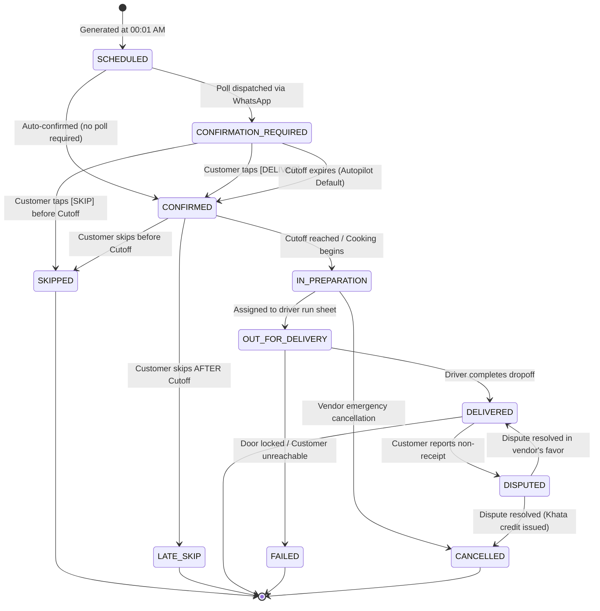

# Feature Specification: Daily Fulfillment Engine

**Classification:** `[CONFIRMED PRODUCT REQUIREMENT]`

---

## 1. Overview & Purpose

The **Daily Fulfillment** engine is the execution heart of RUXS. While a subscription represents the long-term intent, a Daily Fulfillment represents **one concrete operational unit of service on a specific calendar day**.

It mediates the critical path between customer morning actions, kitchen production planning, driver delivery runs, and final Khata ledger debits.

---

## 2. The 11-State Fulfillment State Machine



---

## 3. Detailed State Definitions & Guard Conditions

| State | Who Triggers | Description | Financial / Ledger Impact |
| :--- | :--- | :--- | :--- |
| `SCHEDULED` | System (Cron) | Initial baseline created overnight from subscription schedule. | ₹0 |
| `CONFIRMATION_REQUIRED` | System | Morning WhatsApp prompt dispatched; waiting for 1-tap input. | ₹0 |
| `CONFIRMED` | Customer / System | Customer affirmed delivery, or autopilot auto-confirmed at cutoff. | ₹0 (Order committed) |
| `SKIPPED` | Customer | Customer cancelled before cutoff window closed. | ₹0 (No charge) |
| `LATE_SKIP` | Customer | Customer cancelled **after** cutoff window closed. | Debit `LATE_CANCELLATION_FEE` (50% or 100% per vendor rule) |
| `IN_PREPARATION` | Vendor / System | Cutoff locked. Kitchen prep count locked; packing dabbas/cans. | Order locked |
| `OUT_FOR_DELIVERY` | Vendor Admin | Shifted onto driver run sheet; driver leaves hub. | Order en route |
| `DELIVERED` | Delivery Staff | Completed doorstep handover (or drop-off photo). | **Debit Customer Khata** for full unit price + asset handover logged |
| `FAILED` | Delivery Staff | Driver attempted dropoff, but door locked / gate security blocked. | Policy dependent (credited or re-attempted) |
| `DISPUTED` | Customer | Customer contests delivery claim (*"I never got my food"*). | Khata entry flagged for vendor/admin arbitration |
| `CANCELLED` | Vendor Admin | Vendor kitchen failure, weather emergency, or dispute refund. | Full Khata credit reversal if previously charged |

---

## 4. State Transition Invariants & Guard Rules

1. **The Cutoff Guard:**  
   Transition to `SKIPPED` is strictly forbidden if `currentTime > CutoffTime`. Any skip received past cutoff MUST transition to `LATE_SKIP`.
2. **The Ledger Invariant:**  
   A Khata debit entry can **ONLY** be created when transitioning to `DELIVERED` or `LATE_SKIP`. Moving to `CONFIRMED` or `OUT_FOR_DELIVERY` must NEVER debit money.
3. **The Physical Asset Invariant:**  
   When transitioning to `DELIVERED`, the driver payload must contain `assets_delivered` and `assets_collected` counts. The customer's `AssetLedger` updates atomically in the same database transaction.
4. **Idempotency Guard:**  
   If a driver taps `DELIVERED` multiple times due to patchy elevator connectivity, only the first transition executes. Subsequent identical requests return the current state without side effects.

---

## 5. Conceptual Schema: DailyFulfillment

```typescript
interface DailyFulfillment {
  id: string;                         // UUID
  tenant_id: string;                  // Vendor ID
  subscription_id: string;            // Parent Subscription
  customer_id: string;                // User ID
  service_date: string;               // YYYY-MM-DD
  shift: "MORNING" | "LUNCH" | "EVENING" | "NIGHT";
  status: 
    | "SCHEDULED"
    | "CONFIRMATION_REQUIRED"
    | "CONFIRMED"
    | "SKIPPED"
    | "LATE_SKIP"
    | "IN_PREPARATION"
    | "OUT_FOR_DELIVERY"
    | "DELIVERED"
    | "FAILED"
    | "DISPUTED"
    | "CANCELLED";
  
  // Cutoff tracking
  cutoff_time: Date;
  customer_action_time?: Date;
  late_skip_reason?: string;

  // Delivery & Proof
  delivery_staff_id?: string;
  delivered_at?: Date;
  proof_type?: "GEO_TAG" | "PHOTO" | "CUSTOMER_QR" | "NONE";
  proof_url?: string;
  failure_reason?: string;

  // Assets Handled Today
  assets_delivered: number;           // e.g., 1 can
  assets_collected: number;           // e.g., 1 empty
  
  // Financial snapshot
  total_charge_paise: number;         // e.g., 9000 (₹90.00)
  khata_entry_id?: string;            // Linked ledger entry once debited

  created_at: Date;
  updated_at: Date;
}
```
