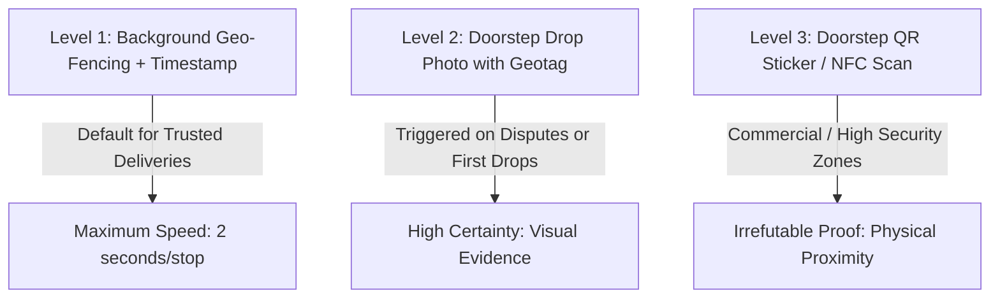

# Feature Specification: Delivery Verification & Proof of Service

**Classification:** `[CONFIRMED PRODUCT REQUIREMENT]`

---

## 1. The Verification Dilemma: Trust vs. Friction

In high-volume recurring delivery, traditional e-commerce verification methods break down:
* **Customer OTP:** Unusable when milk is dropped at 5:30 AM while the customer sleeps, or when a student is attending a college lecture during lunch tiffin drop.
* **Customer Physical Signature:** Too slow; adds 45 seconds per stop, doubling run duration.
* **Blind Driver Tap (`delivered = true`):** Prone to driver errors, false claims, and untraceable customer disputes.

RUXS introduces a **Graduated Verification Hierarchy** that balances operational speed against evidentiary certainty.

---

## 2. Graduated Verification Levels

### Level 1: Background Telemetry & Geostamp (Default for MVP)
* When the driver taps `DELIVERED`, the mobile browser/app automatically captures:
  * Device GPS coordinates (latitude, longitude, horizontal accuracy).
  * System timestamp (UTC & Local).
* If the delivery coordinates match the registered apartment society geofence within 150 meters, the delivery is verified as **Geo-Compliant**.

### Level 2: Geotagged Doorstep Photo (High-Risk / Dispute-Prone)
* Driver snaps a fast photo of the tiffin dabba or water jar placed on the doorstep or hung on the door handle.
* Photo metadata embeds watermarked timestamp, customer address, and GPS coordinates.
* **When Enforced:**
  1. For a customer's first 3 deliveries.
  2. For any customer who filed a non-delivery dispute in the prior 60 days.
  3. For orders marked as dropped without an in-person handover.

### Level 3: Physical Doorstep QR Sticker / NFC Tag (Phase 4)
* A durable weatherproof QR code sticker or NFC chip is affixed to the customer's doorbell or milk bag holder.
* Driver must physically scan the door sticker to unlock the `DELIVERED` button.
* Eliminates driver geofence spoofing completely.

---

## 3. Dispute Evidentiary Flow

When a customer reports: *"I did not receive my delivery today"*:
1. RUXS instantly queries the `DeliveryVerificationRecord` linked to that `DailyFulfillment.id`.
2. Inspects telemetry:
   * Did driver GPS match customer door coordinates? (e.g., Accuracy: ±8m at 12:44 PM).
   * Was a photo captured?
3. If valid photo and GPS exist:
   * Photo is displayed to customer on WhatsApp: *"Driver Ramesh dropped your meal at 12:44 PM at this location. Please verify outside your door."* (Solves 85% of cases where neighbors accidentally took the dabba or flatmates brought it inside without telling).
4. If no telemetry or coordinates show the driver was 2 km away:
   * Instant automatic Khata credit issued to customer; driver performance logged.
