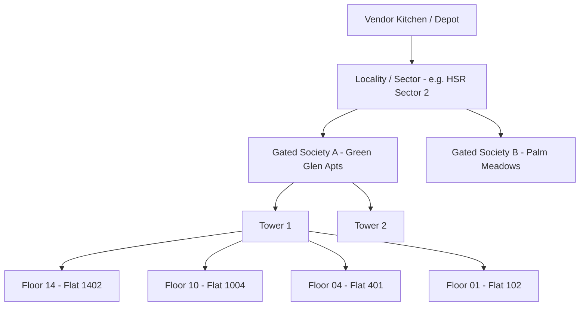
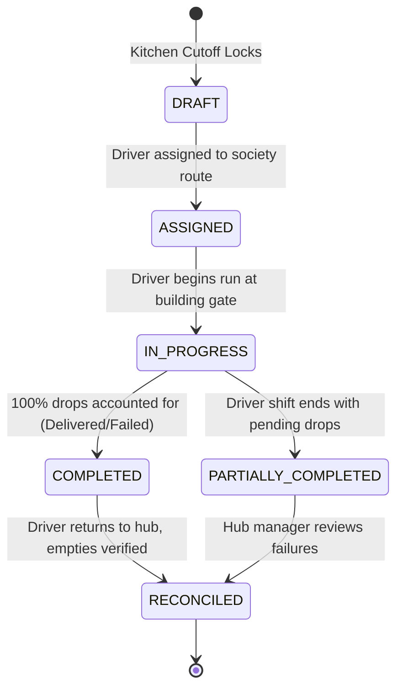

# Feature Specification: Delivery Management & Run Sheets

**Classification:** `[CONFIRMED PRODUCT REQUIREMENT]`

---

## 1. Overview: The Hyper-Local Delivery Reality

In hyper-local recurring services, delivery logistics do **NOT** look like Swiggy, Uber, or Amazon. 

A hyper-local delivery worker:
* Delivers 40 to 90 drops in a concentrated 90-minute morning or lunch window.
* Operates within 1 or 2 large gated societies, or a 1.5 km radius.
* Already knows the fastest shortcuts between buildings, but struggles with **daily dynamic exclusions** (*"Who skipped today?"*).

The primary purpose of the RUXS Delivery module is to generate **live, dynamically updated digital run sheets** that prevent wasted knocks, optimize stair/elevator sequences, and capture doorstep asset handovers.

---

## 2. Hierarchical Address Clustering & Run Sheet Sequencing

To minimize elevator and walking time, deliveries are clustered hierarchically:



### Elevator Optimization (Top-Down Drop Sequence)
Drivers in high-rise towers take the elevator to the top floor and walk down the stairs floor-by-floor dropping packets. The RUXS run sheet orders apartment drops from highest floor to lowest floor within each tower.

---

## 3. Sample Mobile Run Sheet UI View

```
============================================================
           RUN SHEET: LUNCH SHIFT - 11 OCT 2026            
 Driver: Ramesh | Society: Oakwood Residency | Total: 28 Drops
============================================================

TOWER A (14 Drops):
------------------------------------------------------------
[✓ 12:35 PM] Flat 1402 - Rahul Sharma (Regular Thali)
             Assets: +1 Dabba In / -1 Dabba Out

[  SKIP    ] Flat 1204 - Vikram Singh (SKIPPED AT 09:12 AM)
             [GRAYED OUT - DO NOT KNOCK]

[CURRENT > ] Flat 1001 - Ananya Iyer (Jain Thali + 2 Rotis)
             Note: "Leave on door handle bag"
             [ MARK DELIVERED ]   [ FAILED ]

[PENDING   ] Flat 0803 - Deepa Nair (Regular Thali)
[PENDING   ] Flat 0402 - Rohit Verma (Regular Thali)

TOWER B (14 Drops):
...
============================================================
```

---

## 4. Run Sheet Lifecycle State Machine



---

## 5. Conceptual Schema: DeliveryRun and DeliveryStop

```typescript
interface DeliveryRun {
  id: string;                         // UUID
  tenant_id: string;
  driver_id: string;
  shift: "MORNING" | "LUNCH" | "EVENING" | "NIGHT";
  run_date: string;                   // YYYY-MM-DD
  
  status: "ASSIGNED" | "IN_PROGRESS" | "COMPLETED" | "RECONCILED";
  total_stops: number;
  completed_stops: number;
  failed_stops: number;
  skipped_stops: number;
  
  started_at?: Date;
  completed_at?: Date;
}

interface DeliveryStop {
  id: string;
  delivery_run_id: string;
  fulfillment_id: string;
  customer_id: string;
  
  sequence_order: number;             // 1, 2, 3...
  society_name: string;
  tower_or_wing: string;
  floor_number: number;
  flat_number: string;
  delivery_notes?: string;            // e.g., "Leave at doorstep bag"
  
  status: "PENDING" | "DELIVERED" | "FAILED" | "SKIPPED";
  delivered_at?: Date;
  failure_reason?: string;
  
  // Asset exchange at this stop
  assets_delivered: number;           // e.g., 1
  assets_collected: number;           // e.g., 1
  
  proof_type?: "NONE" | "GEO_TAG" | "PHOTO";
  proof_url?: string;
}
```

---

## 6. Future Capabilities (Phase 3+)
* **Dynamic Proximity Sequencing:** TSP (Traveling Salesperson Problem) algorithmic sorting across non-society standalone villas and houses.
* **Live Driver ETA Broadcast:** Approximate live arrival notification (*"Ramesh is 3 houses away"*) based on completed upstream stops.
* **Offline Run Sheet PWA:** Full offline caching on the driver's phone with automatic local SQLite sync when re-emerging from signal-free basement parking lots.
