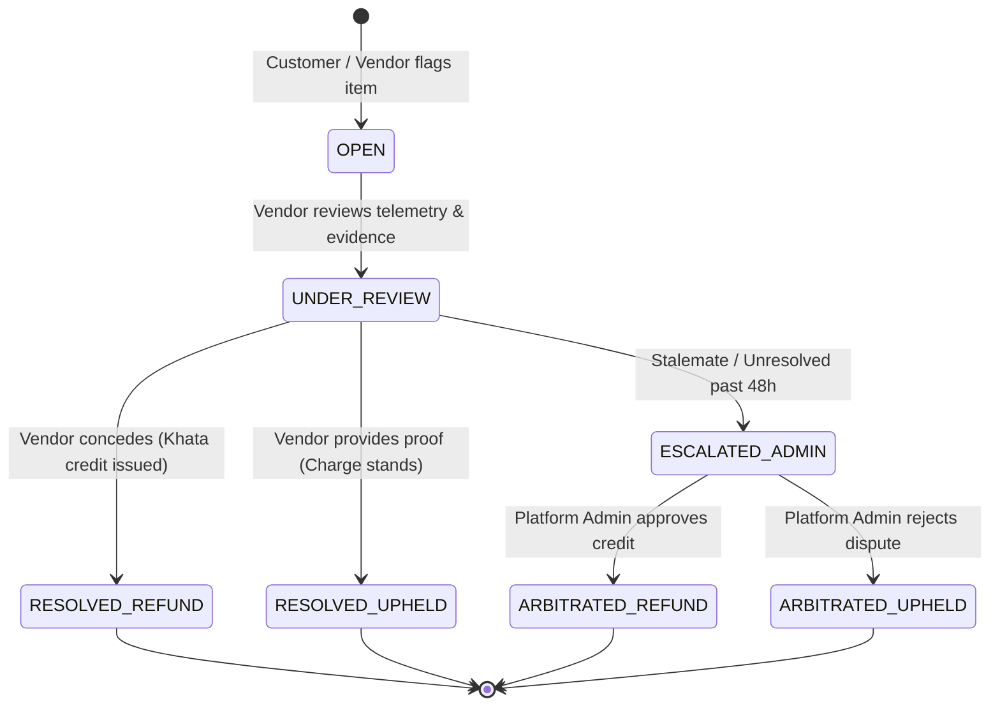

# Feature Specification: Dispute Management & Ledger Arbitration

**Classification:** `[CONFIRMED PRODUCT REQUIREMENT]`

---

## 1. Overview & Operational Need

Disputes are an unavoidable reality in daily recurring fulfillment:
* Customer claims: *"I was out of town on Wednesday, but was charged ₹90 for lunch."*
* Vendor claims: *"Customer messaged at 11:30 AM, well after our 10:00 AM cutoff; meal was cooked."*
* Delivery claims: *"Driver says he dropped the water jar at 2:00 PM, but customer says no jar was left."*

RUXS eliminates 90% of disputes upfront through timestamped WhatsApp button logs and geostamped delivery proofs. When disputes do arise, the **Dispute Management Engine** provides an auditable arbitration workflow grounded in the Digital Khata.

---

## 2. Dispute Lifecycle State Machine



---

## 3. Evidence Matrix

When a dispute ticket is opened, RUXS automatically aggregates an **Evidence Bundle**:

```
============================================================
              DISPUTE EVIDENCE BUNDLE #DISP-892             
 Customer: Rahul Sharma | Vendor: Sharma Kitchen            
 Linked Order: Lunch Shift - 08 Oct 2026 (Status: DELIVERED)
============================================================

1. CUTOFF & INTERACTION LOGS:
   • 08:30:02 AM - Morning WhatsApp Poll Dispatched (Meta ID: wamid.HB82)
   • 08:30:14 AM - Poll Delivered to Customer Device
   • NO CUSTOMER ACTION RECEIVED PRIOR TO CUTOFF
   • 10:00:00 AM - Cutoff Locked -> Autopilot Auto-Confirmed

2. DELIVERY TELEMETRY:
   • 12:44:18 PM - Driver Ramesh arrived at Society Geofence
   • 12:46:02 PM - Marked DELIVERED
   • GPS Accuracy: ±6 meters (Lat: 12.9234, Lon: 77.6412)
   • Drop Photo Attached: [Doorstep Drop - Bag on Handle]

3. ASSET LOGS:
   • Dabbas Exchanged: 1 Full In / 1 Empty Out
============================================================
```

---

## 4. Ledger Resolution & Compensating Entries

> **IMMUTABILITY INVARIANT:** A dispute resolution **NEVER deletes or alters the original debit entry**.  
> If resolved in the customer's favor, the engine appends an atomic `DISPUTE_REFUND` credit entry referencing the original `KhataEntry.id` and `Dispute.id`.

```typescript
interface Dispute {
  id: string;                         // UUID
  tenant_id: string;                  // Vendor ID
  customer_id: string;                // Complainant ID
  fulfillment_id: string;             // Contested fulfillment
  khata_entry_id: string;             // Contested financial charge
  
  category: 
    | "NON_DELIVERY"
    | "LATE_DELIVERY"
    | "WRONG_ITEM"
    | "FOOD_QUALITY"
    | "UNAUTHORIZED_CHARGE"
    | "ASSET_COUNT_MISMATCH";

  status: 
    | "OPEN"
    | "UNDER_REVIEW"
    | "RESOLVED_REFUND"
    | "RESOLVED_UPHELD"
    | "ESCALATED_ADMIN";

  customer_notes: string;
  vendor_response?: string;
  resolution_notes?: string;
  refund_amount_paise?: number;       // e.g., 9000 (₹90.00)
  
  resolved_by_user_id?: string;
  created_at: Date;
  resolved_at?: Date;
}
```
