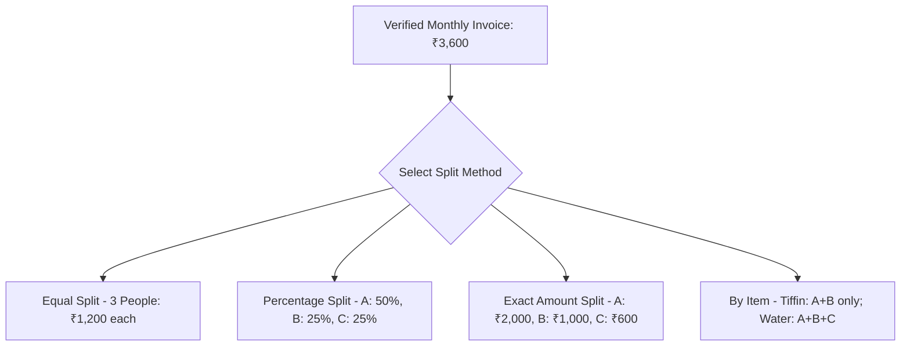
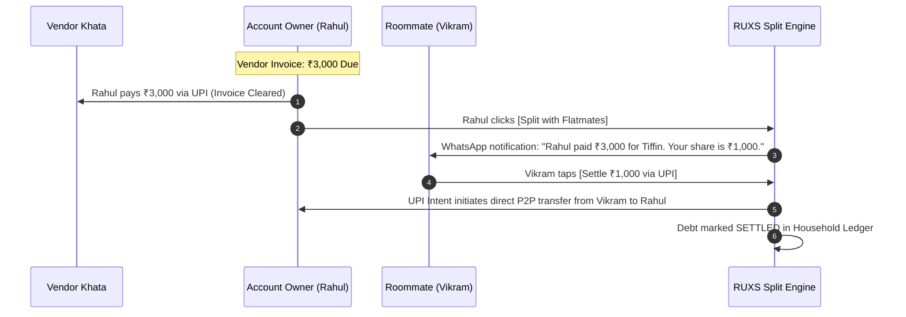

# Feature Specification: Household Expense Splitting (Splitwise Layer)

**Classification:** `[PROPOSED DESIGN - TARGET: PHASE 5]`  
*(Documented for comprehensive architectural foresight; strictly excluded from Phase 1 MVP).*

---

## 1. Overview & Problem

In shared apartments across urban centers like Bangalore, Mumbai, Pune, and Gurgaon, 3–4 flatmates routinely share recurring domestic expenses:
* Rahul pays the monthly water bill (₹1,200).
* Vikram pays the morning milk bill (₹2,400).
* Ankit pays the homestyle dinner tiffin service (₹7,500).

Currently, these transactions must be manually calculated and re-entered into third-party apps like Splitwise. Users forget to log them, numbers diverge from the actual vendor invoice, and roommates argue over unverified expenses.

The **RUXS Expense Splitting Layer** sits directly on top of verified RUXS invoices, enabling 1-click automatic bill division, debt tracking, and native UPI peer settlements.

---

## 2. Split Mechanisms



1. **Equal Split ($\frac{1}{N}$):** Standard for shared common utilities (Water cans, Wi-Fi, Newspaper).
2. **Percentage Split:** Used when flatmates have agreed variable shares (e.g., master bedroom occupant pays 40%).
3. **Exact Amount Split:** Explicit custom amounts entered for each participant.
4. **Itemized Service Split:** Subscriptions within an invoice are allocated only to participating members (e.g., Vikram does not drink milk; milk charges are split only between Rahul and Ankit).

---

## 3. The Peer Settlement Flow

> **CRITICAL ARCHITECTURAL BOUNDARY:** The local vendor is **NEVER a party to household roommate debt**.  
> The Primary Account Owner remains 100% liable to pay the full invoice to the vendor. The expense splitting engine is strictly an **internal peer-to-peer reimbursement ledger** between flatmates.



---

## 4. Conceptual Data Schema: Expense, Participant, and Settlement

```typescript
interface HouseholdExpense {
  id: string;                         // UUID
  household_id: string;
  source_invoice_id?: string;         // Linked verified RUXS invoice
  created_by_user_id: string;
  
  title: string;                      // e.g., "October Tiffin & Water Bill"
  total_amount_paise: number;         // e.g., 300000 (₹3,000.00)
  paid_by_user_id: string;            // The person who cleared the vendor invoice
  
  split_strategy: "EQUAL" | "PERCENTAGE" | "EXACT" | "ITEMIZED";
  status: "OPEN" | "PARTIALLY_SETTLED" | "SETTLED" | "CANCELLED";
  
  created_at: Date;
}

interface ExpenseParticipant {
  id: string;
  expense_id: string;
  user_id: string;
  
  allocated_amount_paise: number;     // Share owed (e.g., 100000 = ₹1,000.00)
  settled_amount_paise: number;       // Paid so far
  is_settled: boolean;
}

interface PeerSettlement {
  id: string;
  household_id: string;
  payer_user_id: string;              // Roommate who owed money
  receiver_user_id: string;           // Person who originally paid
  amount_paise: number;
  
  payment_method: "UPI_P2P" | "CASH_OFFLINE";
  upi_transaction_ref?: string;
  settled_at: Date;
}
```

---

## 5. MVP Deferral Justification

While highly desirable for young flatshares, building this feature in Phase 1 would:
1. Distract engineering from the critical vendor daily coordination and cutoff loop.
2. Introduce multi-party consensus flows before proving vendor retention.
3. Conflate B2B vendor collections with consumer peer-to-peer social finance.

Therefore, **this module is scheduled for Phase 5** once single-payer household stability is established.
