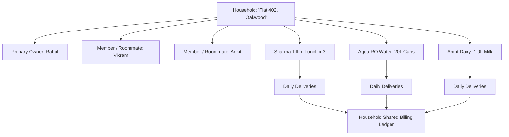

# Feature Specification: Household & Shared Accounts

**Classification:** `[CONFIRMED PRODUCT REQUIREMENT]`

---

## 1. Overview & Conceptual Model

Most e-commerce systems treat a customer as an atomized single individual. In recurring domestic life, services are consumed by a **Household Unit**:
* Three 25-year-old software engineers sharing an apartment in Bangalore (Split water, groceries, tiffin).
* A husband and wife coordinating morning milk and flower deliveries while juggling office commutes.
* An adult son managing tiffin deliveries for elderly parents living in another wing of the same apartment complex.

RUXS introduces **Household Accounts** as a collaborative grouping layer that connects multiple users to a unified set of domestic services.



---

## 2. Household Roles & Permissions

| Capability | Primary Owner | Full Member (e.g. Spouse) | Roommate / Tenant |
| :--- | :---: | :---: | :---: |
| **Invite / Remove Household Members** | Yes | No | No |
| **Add / Cancel Subscriptions** | Yes | Yes | No (View only) |
| **Trigger Daily Skip / Extra Meal** | Yes | Yes | Yes (Configurable) |
| **View Live Delivery Status** | Yes | Yes | Yes |
| **View Household Digital Khata** | Yes | Yes | Yes |
| **Responsible for Final Invoice Payment**| **Primary Liability** | Secondary | Shared via Split |
| **Initiate Expense Splits** | Yes | Yes | Yes |

---

## 3. Communication & Notification Delegation

When the morning WhatsApp prompt fires:
* **Option A (Owner-Only):** Only the primary account owner receives the morning poll. Ideal for families.
* **Option B (All-Members Broadcast):** The prompt is sent to all registered roommates. The first person to tap `[SKIP]` or `[DELIVER]` locks the action for the entire household, and other members receive a broadcast: *"Vikram just skipped today's lunch for Flat 402"*.

---

## 4. Conceptual Schema: Household and HouseholdMember

```typescript
interface Household {
  id: string;                         // UUID
  name: string;                       // e.g., "Flat 402, Oakwood Residency"
  primary_owner_id: string;           // Legally liable user for billing
  
  address: {
    society_name: string;
    tower_wing: string;
    floor_number: number;
    flat_number: string;
    street_address: string;
    city: string;
    pincode: string;
  };
  
  created_at: Date;
  updated_at: Date;
}

interface HouseholdMember {
  id: string;
  household_id: string;
  user_id: string;
  role: "PRIMARY_OWNER" | "ADMIN_MEMBER" | "ROOMMATE_MEMBER" | "VIEWER";
  
  can_skip_fulfillments: boolean;
  receives_daily_whatsapp_poll: boolean;
  shares_household_expenses: boolean;
  
  joined_at: Date;
}
```
