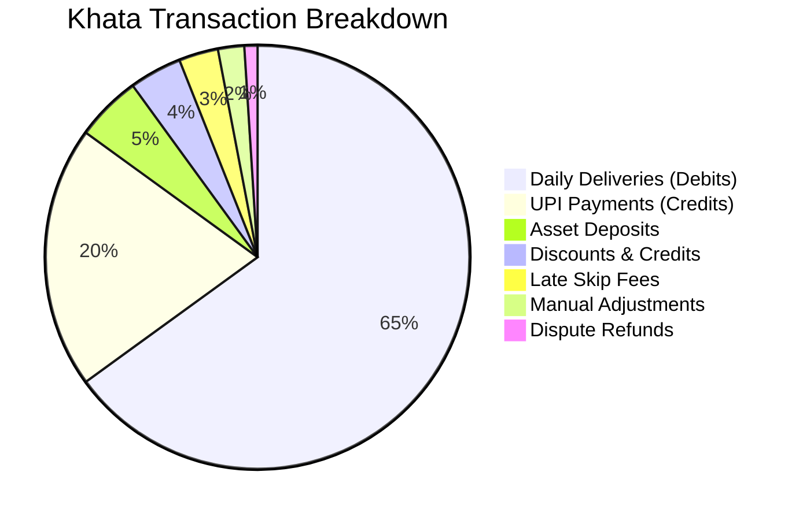

# Feature Specification: Digital Khata (Financial Ledger)

**Classification:** `[CONFIRMED PRODUCT REQUIREMENT]`

---

## 1. Core Architectural Principle: No Mutation Without a Transaction

> **IMMUTABLE INVARIANT:** In RUXS, a customer or vendor balance is **NEVER a mutable database column** updated via `UPDATE users SET balance = balance + 50`.  
> A balance is a materialized view or sum of an immutable, chronologically ordered series of signed **double-entry ledger transactions**.

This mathematical transparency guarantees that:
* Neither a vendor nor a platform admin can silently alter a customer's balance.
* Every single rupee owed traces back to a specific day's fulfillment, delivery timestamp, or verified payment receipt.
* Audits, monthly statements, and tax reconciliations are 100% deterministic.

---

## 2. Ledger Transaction Types



| Transaction Type | Normal Sign | Description | Associated Entity |
| :--- | :---: | :--- | :--- |
| `FULFILLMENT_DEBIT` | `+` (Debit) | Delivery of daily good/service (e.g., 1 Lunch = +₹90). | `DailyFulfillment.id` |
| `PAYMENT_CREDIT` | `-` (Credit)| Payment received from customer via UPI or verified cash. | `Payment.id` |
| `LATE_FEE_DEBIT` | `+` (Debit) | Compensatory charge for skip received past cutoff. | `DailyFulfillment.id` |
| `ASSET_DEPOSIT_DEBIT` | `+` (Debit) | Initial security deposit for 20L water can or tiffin box. | `Asset.id` |
| `ASSET_DEPOSIT_REFUND`| `-` (Credit)| Deposit returned upon return of empty physical assets. | `Asset.id` |
| `SCRAP_CREDIT` | `-` (Credit)| Customer handed over cardboard/scrap; credit applied to bill. | `ScrapCollection.id` |
| `DISCOUNT_CREDIT` | `-` (Credit)| Promotional credit or monthly subscription discount. | `Invoice.id` |
| `DISPUTE_REFUND` | `-` (Credit)| Credit issued to resolve a customer non-delivery complaint. | `Dispute.id` |
| `MANUAL_ADJUSTMENT` | `+/-` | Corrective ledger entry initiated by vendor or admin. | `AuditLog.id` |

---

## 3. Real-World Ledger Trajectory (Example: Rahul)

| Date & Time | Entry Type | Reference / Details | Debit (+) | Credit (-) | Running Balance |
| :--- | :--- | :--- | :---: | :---: | :---: |
| **Jan 01, 13:12** | `FULFILLMENT_DEBIT` | Lunch Delivered (1 Meal) | ₹90.00 | — | **₹90.00 (Due)** |
| **Jan 02, 13:05** | `FULFILLMENT_DEBIT` | Lunch Delivered (1 Meal) | ₹90.00 | — | **₹180.00 (Due)** |
| **Jan 03, 09:14** | *Skipped* | Customer tapped SKIP before cutoff | ₹0.00 | — | **₹180.00 (Due)** |
| **Jan 04, 13:20** | `FULFILLMENT_DEBIT` | Lunch Delivered (1 Meal + 2 Rotis) | ₹110.00 | — | **₹290.00 (Due)** |
| **Jan 05, 14:02** | `PAYMENT_CREDIT` | UPI Pay (Ref: `UPI/62819/AXIS`) | — | ₹290.00 | **₹0.00 (Cleared)** |
| **Jan 06, 11:15** | `LATE_FEE_DEBIT` | Cancelled at 11:15 AM (Cutoff was 10 AM, 50%) | ₹45.00 | — | **₹45.00 (Due)** |

---

## 4. Conceptual Data Schema: KhataEntry

```typescript
interface KhataEntry {
  id: string;                         // UUID
  tenant_id: string;                  // Vendor ID
  customer_id: string;                // User ID
  household_id?: string;              // Optional household association
  
  entry_type: 
    | "FULFILLMENT_DEBIT"
    | "PAYMENT_CREDIT"
    | "LATE_FEE_DEBIT"
    | "ASSET_DEPOSIT_DEBIT"
    | "ASSET_DEPOSIT_REFUND"
    | "SCRAP_CREDIT"
    | "DISCOUNT_CREDIT"
    | "DISPUTE_REFUND"
    | "MANUAL_ADJUSTMENT";

  // Financial values in integer Paise (INR) to eliminate floating-point drift
  amount_paise: number;               // Always positive integer (e.g., 9000 = ₹90.00)
  direction: "DEBIT" | "CREDIT";      // DEBIT = increases amount owed by customer; CREDIT = reduces it

  // Running balance snapshot for O(1) balance reads and cryptographic verification
  running_balance_paise: number;      // Net customer balance after this entry
  
  // Strict provenance & relational links
  reference_type: "FULFILLMENT" | "PAYMENT" | "INVOICE" | "DISPUTE" | "MANUAL";
  reference_id: string;               // UUID of source entity
  description: string;                // Human-readable line item (e.g., "Lunch Delivery - 1 Regular Meal")
  
  created_by_user_id: string;         // System User ID, Vendor Admin ID, or Customer ID
  created_at: Date;                   // Immutable creation timestamp
}
```

---

## 5. Mathematical Invariants & Anti-Corruption Rules

1. **Paise Integer Arithmetic:** All amounts stored as signed/unsigned 64-bit integers in **paise** (`₹1.00 = 100 paise`). Never use floating-point numbers (`0.1 + 0.2 = 0.30000000000000004`).
2. **Append-Only Table:** SQL `UPDATE` and `DELETE` permissions are strictly revoked on the `khata_entries` table. Corrections MUST be implemented by appending a compensating entry (`MANUAL_ADJUSTMENT` or `DISPUTE_REFUND`).
3. **Database Transaction Boundary:** When an order is marked `DELIVERED`, the status transition on `DailyFulfillment` and the insert into `KhataEntry` MUST occur within the same serializable database transaction:
   $$\text{BEGIN TRANSACTION} \implies \text{UPDATE fulfillment} \implies \text{INSERT khata\_entry} \implies \text{COMMIT}$$
