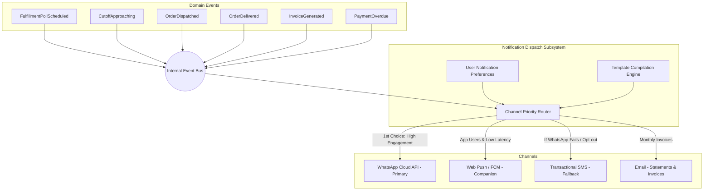
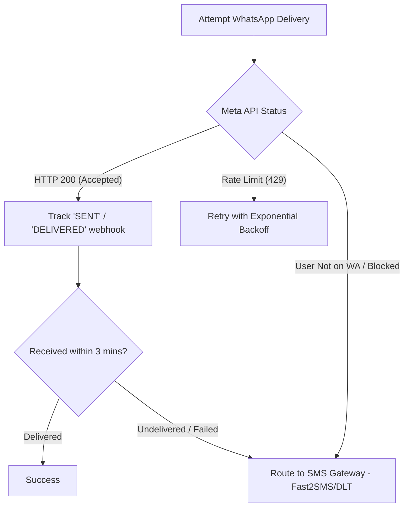

# Feature Specification: Notification Engine & Multi-Channel Dispatch

**Classification:** `[CONFIRMED PRODUCT REQUIREMENT]`

---

## 1. Event-Driven Notification Architecture

> **CORE PRINCIPLE:** Notification triggers must **NEVER be hard-coded inside random business logic or controllers**.  
> All notifications are emitted as typed **Domain Events** onto an event bus. The **Notification Dispatcher** subscribes to domain events, resolves customer preferences, selects the optimal channel, and handles retries and fallbacks.



---

## 2. Notification Event Catalog

| Event Name | Default Channel | Trigger Condition | Message Content / Template |
| :--- | :--- | :--- | :--- |
| `FulfillmentPollScheduled` | WhatsApp | Morning schedule trigger | *"Today's lunch? [DELIVER] [SKIP] [EXTRA]"* |
| `CutoffApproaching` | WhatsApp / Push | 30 mins before cutoff | *"Prep locks in 30 mins. Autopilot delivery active unless skipped."* |
| `OrderDispatched` | WhatsApp / Push | Driver starts run sheet | *"Your water jar is on the way with Ramesh."* |
| `DriverProximityAlert` (Phase 3) | Push / WhatsApp | Driver within 3 buildings | *"Ramesh is 3 houses away."* |
| `OrderDelivered` | WhatsApp / Push | Driver marks delivered | *"Lunch delivered outside door at 12:42 PM. Enjoy!"* |
| `InvoiceGenerated` | WhatsApp + Email | 1st of month | *"Your monthly Khata is ready: ₹3,680. Pay via UPI: ruxs.in/pay/..."* |
| `PaymentReminder` | WhatsApp | Day 3 & Day 5 overdue | *"Friendly reminder: ₹450 payment pending for Sharma Kitchen."* |
| `AssetHoldingAlert` | WhatsApp | Holds >3 cans for 7 days| *"You have 3 empty water cans. Hand them over on next delivery."* |

---

## 3. Fallback & Failover Strategy



* **DLT Compliance:** For Indian SMS fallback, all transactional SMS templates are pre-registered with telecom operators under TRAI DLT guidelines with approved sender IDs (e.g., `RUXSIN`).
* **Quiet Hours:** Non-urgent notifications (e.g., promotional announcements or general statements) are suppressed between 10:00 PM and 7:00 AM. Daily morning fulfillment prompts (scheduled for 6:00 AM–8:30 AM) are classified as critical operational triggers and explicitly exempted.

---

## 4. Conceptual Schema: NotificationLog

```typescript
interface NotificationLog {
  id: string;                         // UUID
  tenant_id: string;
  recipient_user_id: string;
  recipient_phone: string;
  
  event_name: string;                 // e.g., "FulfillmentPollScheduled"
  channel: "WHATSAPP" | "PUSH" | "SMS" | "EMAIL";
  template_id: string;
  
  status: "QUEUED" | "SENT" | "DELIVERED" | "READ" | "FAILED" | "FALLBACK_TRIGGERED";
  
  channel_message_id?: string;        // External provider ID (e.g., Meta wamid)
  error_code?: string;
  error_message?: string;
  
  retry_count: number;
  payload_snapshot: Record<string, any>;
  
  dispatched_at?: Date;
  delivered_at?: Date;
  read_at?: Date;
  created_at: Date;
}
```
