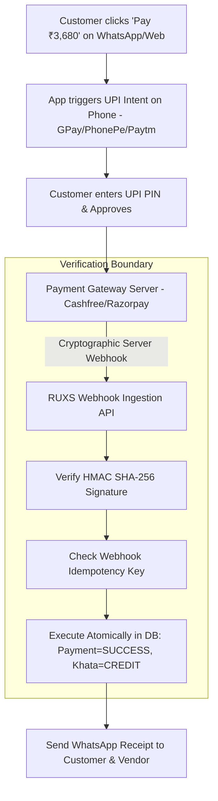
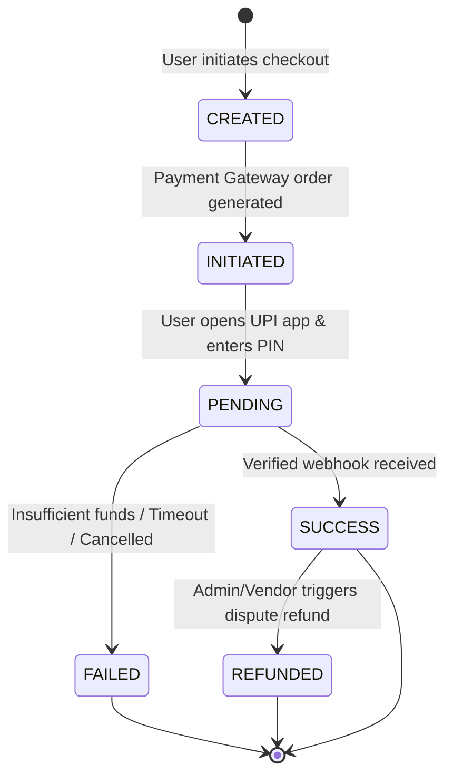

# Feature Specification: UPI Payments & Settlement

**Classification:** `[CONFIRMED PRODUCT REQUIREMENT]`

---

## 1. UPI-First Strategy & Provider Abstraction

In India, UPI accounts for >80% of all consumer digital transactions. RUXS implements a **UPI-First, Provider-Agnostic Payment Subsystem**.

### Fundamental Payment Rule
> **ZERO FRONTEND TRUST:** The system must **NEVER mark a payment successful merely because the client browser or mobile frontend claims so**. A payment is only marked `SUCCESS` upon cryptographic verification of an authentic server-to-server webhook from the payment gateway or bank nodal aggregator.



---

## 2. Supported Payment Modalities

1. **UPI Intent (Mobile Deep-Link):** On mobile web, tapping "Pay" opens installed UPI apps (Google Pay, PhonePe, Paytm, CRED) directly with pre-populated VPA, amount, and reference ID.
2. **Dynamic UPI QR Code:** On desktop web, renders a dynamic Bharat QR code encoded with the exact invoice amount and transaction reference.
3. **UPI AutoPay (Phase 3):** Pre-authorized recurring e-mandate allowing automatic monthly debit on the 1st of each month for authorized amounts up to ₹15,000.
4. **Manual Cash/Offline Reconciliation:** For elderly or cash-reliant customers, the vendor admin can record an offline cash receipt, which appends a `PAYMENT_CREDIT` labeled *"Cash Received by Vendor Admin"*.

---

## 3. Payment Lifecycle State Machine



| State | Trigger | Ledger & Invoice Action |
| :--- | :--- | :--- |
| `CREATED` | User clicks payment link | Order record created; no ledger entry. |
| `INITIATED` | Gateway order ID generated | Redirects to UPI app; no ledger entry. |
| `PENDING` | Bank processing | User waiting; polling or awaiting webhook. |
| `SUCCESS` | Gateway Webhook verified | **Appends `PAYMENT_CREDIT` to Khata**; marks Invoice `PAID`. |
| `FAILED` | Bank declines or user cancels | No ledger mutation; logs error reason. |
| `REFUNDED` | Gateway confirms refund | Appends countervailing `REFUND_DEBIT` or reverses credit. |

---

## 4. Payment Gateway Abstraction Layer

To prevent vendor lock-in with any single gateway (Razorpay, Cashfree, PhonePe PG, Decentro), RUXS encapsulates payments behind an adapter interface:

```typescript
interface PaymentGatewayAdapter {
  createOrder(params: {
    invoiceId: string;
    amountPaise: number;
    customerId: string;
    customerPhone: string;
    description: string;
  }): Promise<{
    gatewayOrderId: string;
    upiIntentUrl: string;
    qrCodeString: string;
  }>;

  verifyWebhookSignature(
    rawBody: string,
    signatureHeader: string,
    secretKey: string
  ): boolean;

  parseWebhookPayload(body: any): {
    gatewayTransactionId: string;
    gatewayOrderId: string;
    amountPaise: number;
    status: "SUCCESS" | "FAILED" | "PENDING";
    utrNumber?: string;
  };
}
```

---

## 5. Conceptual Schema: Payment and PaymentAttempt

```typescript
interface Payment {
  id: string;                         // UUID
  tenant_id: string;                  // Vendor ID
  customer_id: string;                // User ID
  invoice_id?: string;                // Optional linked invoice
  
  amount_paise: number;               // Paid amount in paise
  status: "CREATED" | "INITIATED" | "PENDING" | "SUCCESS" | "FAILED" | "REFUNDED";
  
  method: "UPI_INTENT" | "UPI_QR" | "UPI_AUTOPAY" | "CASH_OFFLINE" | "NET_BANKING";
  gateway_provider: "CASHFREE" | "RAZORPAY" | "PHONEPE" | "OFFLINE";
  gateway_order_id?: string;
  gateway_payment_id?: string;
  bank_utr_number?: string;           // 12-digit UPI UTR number for dispute tracking
  
  khata_entry_id?: string;            // Linked Khata credit entry
  failure_reason?: string;
  
  created_at: Date;
  settled_at?: Date;
}
```
