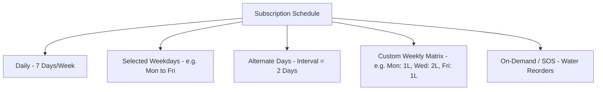
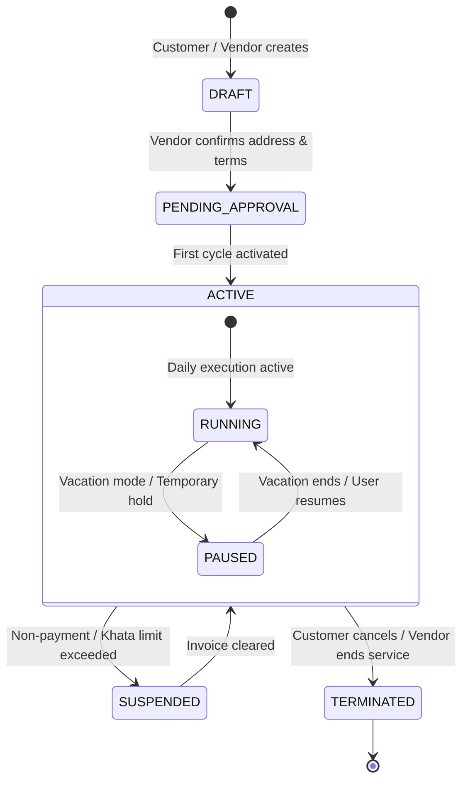

# Feature Specification: Subscriptions Engine

**Classification:** `[CONFIRMED PRODUCT REQUIREMENT]`

---

## 1. Purpose & Domain Overview

The **Subscription** is the central primitive of RUXS. Unlike conventional e-commerce where orders are one-off cart checkouts, RUXS models long-running, recurring contracts between a household and a local vendor.

A subscription dictates:
* What product/service is delivered (e.g., *1L Cow Milk*, *Standard Homestyle Lunch*)
* Delivery schedule and cadence (e.g., *Daily*, *Mon-Fri*, *Alternate Days*)
* Quantity and customization parameters (e.g., *Jain meal*, *Extra Rotis*)
* Operational time windows (e.g., *Morning Shift*, *Lunch Shift*)
* Default action when no customer input is provided (*Autopilot Deliver*)

---

## 2. Subscription Cadence Types

RUXS supports flexible recurring schedule patterns:



1. **Daily (7 Days/Week):** Standard for Milk, Newspapers, Pooja Flowers, and Daily Car Dusting.
2. **Selected Weekdays (e.g., Mon–Fri):** Common for office tiffins where customers cook or eat out on weekends.
3. **Alternate Days (Every N Days):** Standard for 20L Water Jars (e.g., every 2 or 3 days).
4. **Variable Volume Matrix:** Customer receives 1L milk on weekdays, but 2L on Saturday and Sunday.
5. **On-Demand Recurring (SOS Trigger):** Customer does not have a fixed day, but reorders the standard recurring product via a single WhatsApp button when empty.

---

## 3. Subscription Lifecycle & State Machine



### State Definitions & Transition Rules

| State | Description | Allowed Actions |
| :--- | :--- | :--- |
| `DRAFT` | Initial configuration entered by customer or vendor. | Edit terms, assign address, configure cadence. |
| `PENDING_APPROVAL` | Awaiting confirmation (e.g., vendor verifies delivery feasibility to this flat). | Vendor approves or rejects. |
| `ACTIVE` | Normal operating status. Generates daily fulfillment records automatically. | Skip day, add extra, pause, edit schedule. |
| `PAUSED` | Temporary suspension (vacation mode). No daily fulfillments generated. | Resume subscription, extend pause window. |
| `SUSPENDED` | System-triggered lock due to overdue unpaid invoice. | Pay overdue bill to restore `ACTIVE`. |
| `TERMINATED` | Subscription permanently closed. Final reconciliation triggered. | Return physical assets, settle final Khata balance. |

---

## 4. Key Data Fields (Conceptual Entity)

```typescript
interface Subscription {
  id: string;                         // UUID
  tenant_id: string;                  // Vendor ID
  customer_id: string;                // Primary User ID
  household_id: string;               // Associated Household
  service_id: string;                 // e.g., Tiffin, Water
  product_id: string;                 // Base SKU
  status: "DRAFT" | "PENDING_APPROVAL" | "ACTIVE" | "PAUSED" | "SUSPENDED" | "TERMINATED";
  cadence_type: "DAILY" | "WEEKDAYS" | "ALTERNATE_DAYS" | "CUSTOM_MATRIX" | "ON_DEMAND";
  cadence_config: {
    days_of_week?: ("MON" | "TUE" | "WED" | "THU" | "FRI" | "SAT" | "SUN")[];
    interval_days?: number;           // e.g., 2 for alternate days
    day_quantity_map?: Record<string, number>; // { "SAT": 2.0, "SUN": 2.0 }
  };
  default_quantity: number;           // Standard unit count (e.g., 1 meal or 1.5L)
  unit_price: number;                 // Base price snapshot in paise (e.g., 9000 for ₹90.00)
  shift: "MORNING" | "LUNCH" | "EVENING" | "NIGHT";
  delivery_address_id: string;
  autopilot_default: "DELIVER" | "SKIP"; // System default if no response by cutoff
  start_date: Date;
  end_date?: Date | null;             // Optional fixed contract end
  created_at: Date;
  updated_at: Date;
}
```

---

## 5. Daily Generation Engine (The Cron Contract)

Every night at **00:01 AM (Local Time)**, the **Subscription Generator Worker** runs:
1. Queries all `ACTIVE` subscriptions for the current tenant.
2. Evaluates the cadence rule against today's date and day-of-week.
3. Checks for any active `VacationPause` covering today.
4. If eligible, idempotently inserts a `DailyFulfillment` record in `SCHEDULED` state.
5. Populates the morning polling queue for WhatsApp dispatch.
