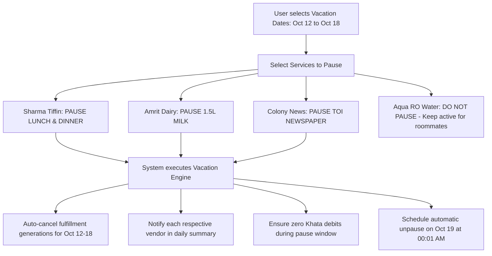

# Feature Specification: Vacation Mode & Multi-Service Pauses

**Classification:** `[CONFIRMED PRODUCT REQUIREMENT]`

---

## 1. Overview & Operational Problem

When an urban family travels out of town (e.g., Diwali vacation, summer holidays, or a 4-day weekend trip), they must currently contact 4–5 different local vendors individually:
* Call the milkman to stop delivery.
* WhatsApp the tiffin kitchen.
* Text the newspaper delivery boy.
* Instruct the car cleaner to skip dusting.

Inevitably, one vendor is forgotten. Milk pouches pile up at the door, alerting burglars that the flat is empty. Tiffins spoil in the sun. At month-end, customers are furious when billed for services delivered while away.

**Vacation Mode** provides a unified calendar interface allowing a household to pause multiple independent services across different vendors for a specified date range in a single action.

---

## 2. Multi-Service Selection & Date Range Model



---

## 3. Vacation Window Rules & Constraints

1. **Lead Time Constraint:**  
   Vacation mode must be set before the respective service cutoffs. If a vacation is created at 11:00 AM on Oct 12, Oct 12 lunch tiffin (cutoff 10:00 AM) is already locked or marked `LATE_SKIP`. The vacation hold takes effect starting with dinner or Oct 13.
2. **Independent Resumption:**  
   If travel plans change and the customer returns early on Oct 16:
   * 1-tap `Resume Early` updates the end date.
   * Daily fulfillments resume starting with the next available shift.
3. **Overlapping Pauses:**  
   If a user extends a vacation from Oct 18 to Oct 22, the system merges the windows without creating duplicate pause records or corrupting the schedule.
4. **Billing Impact:**  
   The system guarantees that zero `DailyFulfillment` rows are generated in `DELIVERED` status for paused dates. Unused subscription days generate zero Khata debits.

---

## 4. Conceptual Schema: VacationPause

```typescript
interface VacationPause {
  id: string;                         // UUID
  customer_id: string;                // User ID
  household_id?: string;
  
  start_date: string;                 // YYYY-MM-DD (Inclusive)
  end_date: string;                   // YYYY-MM-DD (Inclusive)
  
  // Selected subscription IDs to pause
  subscription_ids: string[];
  
  status: "SCHEDULED" | "ACTIVE" | "COMPLETED" | "CANCELLED_EARLY";
  
  reason?: string;                    // e.g., "Family holiday"
  resumed_early_at?: Date;
  
  created_at: Date;
  updated_at: Date;
}
```
