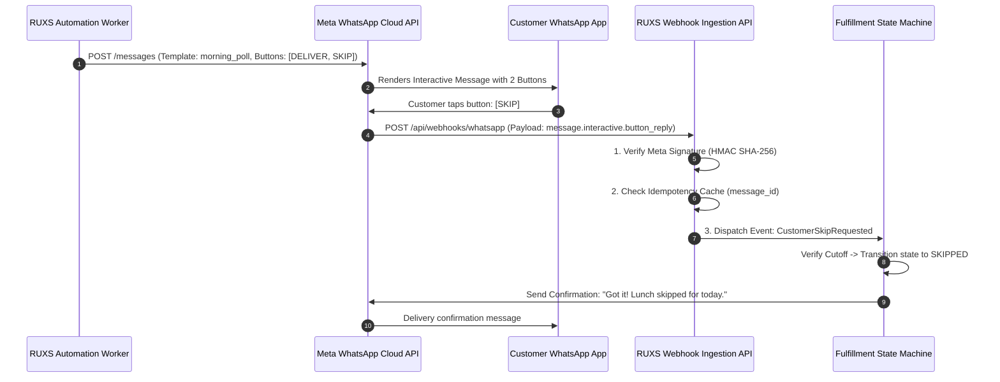
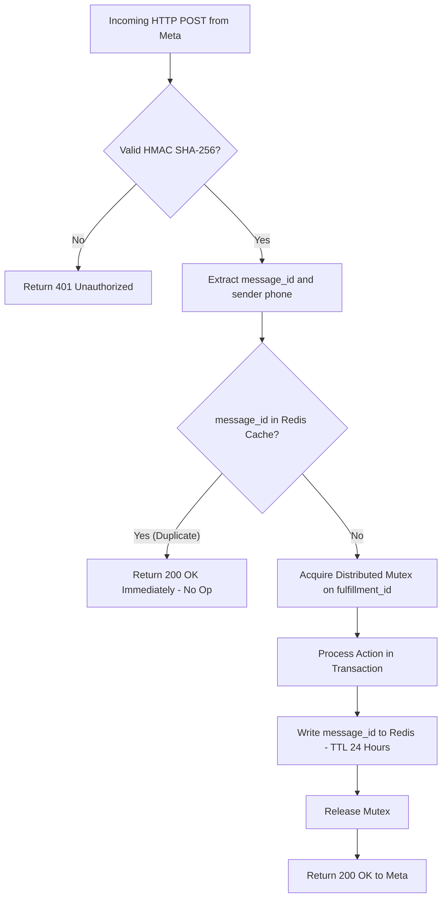

# Feature Specification: WhatsApp-First Architecture

**Classification:** `[CONFIRMED PRODUCT REQUIREMENT]`

---

## 1. Architectural Role & Flow

WhatsApp is the primary conversational and operational touchpoint for consumers in RUXS. Instead of requiring users to download a mobile app, RUXS leverages the official **Meta WhatsApp Cloud API** to conduct daily 1-tap fulfillment polls, send delivery notifications, and dispatch monthly payment links.

---

## 2. Meta Message Templates & Interactive Components

### 2.1 Morning Fulfillment Poll Template (`ruxs_daily_poll_v1`)
* **Category:** Utility
* **Trigger:** Daily morning schedule (e.g., 8:30 AM).
* **Body Text:**  
  *"Good morning {{1}}! Today's lunch from {{2}}: [Homestyle Thali - 4 Rotis, Dal, Paneer Bhurji, Rice]. What would you like us to do?"*
* **Interactive Buttons (Quick Reply):**
  * Button 1: `[DELIVER]` (Payload: `ACTION:CONFIRM:FULFILLMENT_{{ID}}`)
  * Button 2: `[SKIP TODAY]` (Payload: `ACTION:SKIP:FULFILLMENT_{{ID}}`)
  * Button 3: `[ADD EXTRA ROTIS]` (Payload: `ACTION:EXTRA:FULFILLMENT_{{ID}}`)

### 2.2 Cutoff Warning Template (`ruxs_cutoff_warning_v1`)
* **Category:** Utility
* **Trigger:** 30 minutes prior to cutoff if status is still unconfirmed.
* **Body Text:**  
  *"Reminder: Kitchen prep for {{1}} locks at {{2}} (in 30 mins). If you do nothing, we will deliver your meal as normal on autopilot."*

### 2.3 Delivery Confirmation Template (`ruxs_delivery_success_v1`)
* **Category:** Utility
* **Trigger:** Driver taps `DELIVERED`.
* **Body Text:**  
  *"Your lunch was just delivered at {{1}} by {{2}}. Enjoy your meal! (Empty dabbas collected: {{3}})."*

### 2.4 Monthly Statement & Payment Template (`ruxs_monthly_invoice_v1`)
* **Category:** Utility
* **Trigger:** 1st of month at 10:00 AM.
* **Body Text:**  
  *"Your {{1}} bill from {{2}} is ready: ₹{{3}} for {{4}} deliveries. View itemized ledger or pay instantly via UPI below."*
* **Call-to-Action Button:**
  * URL: `https://ruxs.in/pay/{{5}}`

---

## 3. Webhook Handling & Idempotency Pipeline

Meta webhooks can fire out of order, retry up to 7 times on network timeouts, or deliver duplicates. The RUXS ingestion pipeline enforces strict defense-in-depth:

---

## 4. Phone Number Identity Mapping

1. **E.164 Format Normalization:** All incoming phone numbers are stripped of punctuation and normalized to standard Indian E.164 format: `+91XXXXXXXXXX`.
2. **User Resolution:**
   * Incoming number matches `User.phone_number`.
   * If not registered, system checks for pending invitations or creates an unauthenticated customer profile mapped to the inviting vendor's tenant.
3. **Session Context:** Interactive button payloads contain self-describing signed tokens (e.g., `enc(tenant_id, fulfillment_id, action)`) ensuring actions cannot be spoofed by forwarding messages to third parties.

---

## 5. Meta Policy Compliance: Opt-In & Opt-Out

* **Consent Capture:** When a vendor adds a customer, RUXS sends a welcome message requiring explicit acceptance: *"Reply YES to receive your daily tiffin notifications on WhatsApp."*
* **STOP / Opt-Out Support:** If a user types `STOP`, `UNSUBSCRIBE`, or `CANCEL`, the system immediately flags `User.whatsapp_opt_in = false`. Future notifications immediately divert to the SMS / Web Push fallback pipeline.
