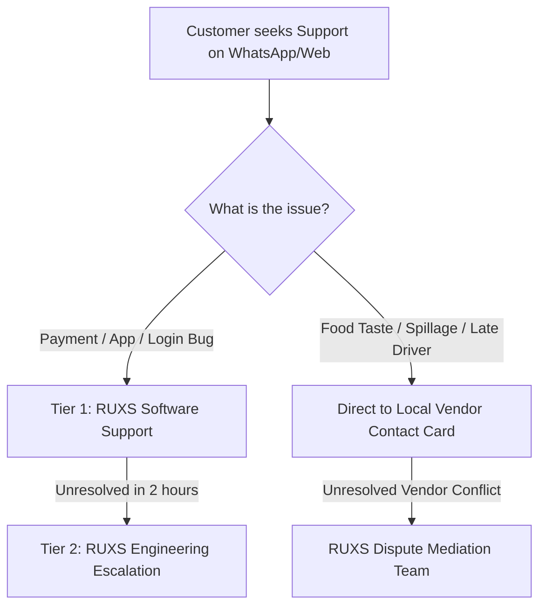

# Customer Support & Escalation SOPs: RUXS

**Classification:** `[CONFIRMED OPERATIONAL SPECIFICATION]`

---

## 1. Support Philosophy: Clear Operational Boundaries

A critical operational risk for RUXS is becoming a free call-center for bad cooking or spilled dal. We maintain a **strict, transparent boundary** between:
1. **Platform Software Support (Handled by RUXS):** App bugs, broken WhatsApp buttons, UPI payment processing issues, OTP failures.
2. **Service & Quality Support (Handled by the Vendor):** Delayed deliveries, salty food, sour milk, cracked tiffin lids, change in meal preferences.

---

## 2. Support Tiers & SLAs

| Tier | Handled By | Scope of Issues | Response SLA | Resolution SLA |
| :--- | :--- | :--- | :---: | :---: |
| **Vendor Direct** | Local Vendor Admin | Food taste, cold delivery, spillage, meal change | < 15 mins | Immediate |
| **Tier 1 (RUXS Ops)** | Central Support Desk | WhatsApp button failures, payment debited but not reflected | < 30 mins | < 2 hours |
| **Tier 2 (RUXS Eng)** | Platform On-Call | Database inconsistencies, webhook drops, security incidents | < 15 mins | < 4 hours |
| **Mediation Desk** | Operations Lead | Unresolved customer-vendor billing disputes > ₹500 | < 24 hours | < 48 hours |

---

## 3. Standard Support Playbooks

### Playbook 1: Payment Debited from Bank Account but Invoice Still Shows "PENDING"
* **Customer Inquiry:** *"I paid ₹3,680 via GPay, money left my HDFC account, but RUXS still says unpaid."*
* **Root Cause:** Asynchronous bank nodal delay or delayed gateway webhook.
* **Agent Action:**
  1. Request the 12-digit UPI **Bank UTR Number** from the customer.
  2. Open payment gateway portal and query transactions by UTR.
  3. If status is `SUCCESS` at gateway: click `Force Webhook Replay`.
  4. System idempotently appends `PAYMENT_CREDIT` to Khata and marks invoice `PAID`.
  5. If status is `FAILED` or `PENDING` at bank: reassure customer that money will automatically reverse to their bank account within 2–3 business days as per RBI guidelines.

### Playbook 2: WhatsApp Number Blocked or Messages Not Arriving
* **Agent Action:**
  1. Check Meta WhatsApp API delivery status in admin portal.
  2. Verify if user has previously replied `STOP` or revoked opt-in.
  3. If user opted out, guide them to send `START` to the official RUXS WhatsApp business number.
  4. Send SMS fallback verification OTP if user is attempting to log in on the web.
