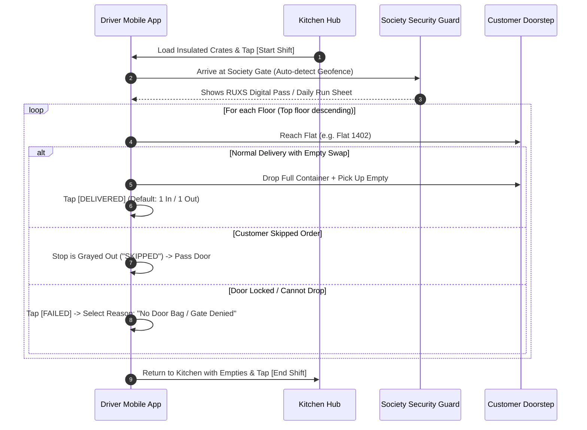

# Standard Operating Procedures: Delivery & Field Operations

**Classification:** `[CONFIRMED OPERATIONAL SPECIFICATION]`

---

## 1. Field Delivery Workflow

The field delivery workflow is designed for maximum speed, minimal cognitive burden, and error resistance while navigating apartment buildings:

---

## 2. Doorstep Exception Protocols

### Exception 1: Society Guard Blocks Entry
* **Protocol:**
  1. Driver displays the **RUXS Digital Delivery Pass** in the driver app, showing the exact list of residents awaiting food in that building.
  2. If still denied, driver taps `[BLOCKED BY GUARD]`.
  3. System triggers an automated WhatsApp ping to all residents in that building: *"Your delivery driver Ramesh is held up at Main Gate Security. Please authorize entry on MyGate / NoBrokerHood."*

### Exception 2: Customer Door Locked & No Drop Bag Present
* **Protocol:**
  1. Driver rings bell or knocks once.
  2. Waits 60 seconds.
  3. If no answer, taps `[CALL CUSTOMER]` via the integrated dialer.
  4. If customer does not answer after 2 rings, driver marks `FAILED` with reason `CUSTOMER_UNREACHABLE`.
  5. The food is brought back to the hub. The customer's Khata is treated according to vendor policy (typically full charge if food was cooked).

### Exception 3: Customer Takes Water Jar But Has No Empty to Return
* **Protocol:**
  1. Driver taps the container stepper:
     * `Delivered: 1 Jar`
     * `Collected: 0 Jars`
  2. Driver alerts customer: *"Bhaiya, I have logged that you did not return an empty today. Your holding balance is now 2 jars."*
  3. The customer receives an instant WhatsApp receipt reflecting their updated jar holding count.
