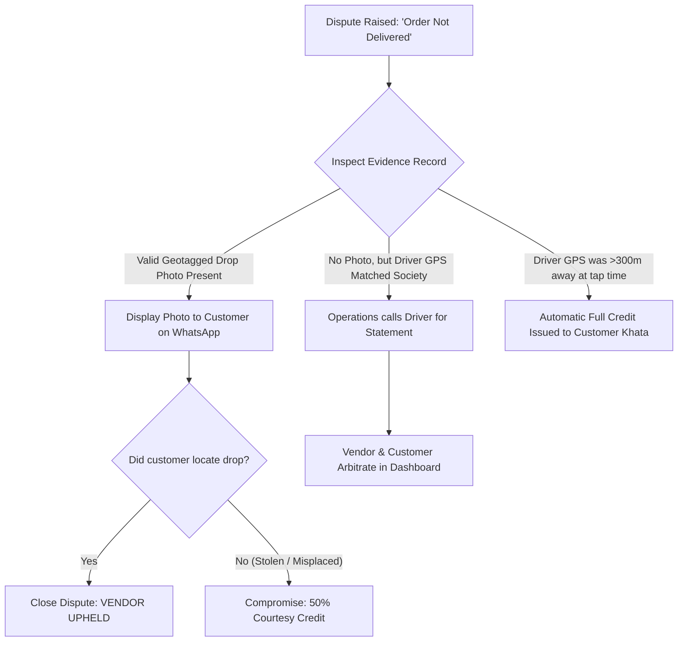

# Dispute Management & Arbitration SOPs: RUXS

**Classification:** `[CONFIRMED OPERATIONAL SPECIFICATION]`

---

## 1. Rules of Engagement & Arbitration Principles

When a customer contests a fulfillment charge or asset count, RUXS operates as a neutral, evidence-driven arbiter.

### Core Arbitration Principles:
1. **Timestamp Primacy:** System timestamps recorded at database ingress take precedence over verbal recollections.
2. **Evidence Weighting:**
   $$\text{Verified Geotagged Photo} > \text{GPS Telemetry within 50m} > \text{Driver Checkoff} > \text{Verbal Claim}$$
3. **Financial Protection:** Contested funds remain temporarily isolated from vendor automated payouts until the dispute is resolved.

---

## 2. Standard Dispute Arbitration Protocols

---

## 3. Dispute Resolution Actions & Ledger Execution

| Dispute Outcome | Trigger Criteria | Technical & Ledger Action |
| :--- | :--- | :--- |
| `RESOLVED_CUSTOMER_REFUND` | Driver GPS was invalid, driver conceded error, or spillage occurred. | Atomic insert of `DISPUTE_REFUND` credit entry to customer Khata. Debit applied to vendor settlement payout. |
| `RESOLVED_VENDOR_UPHELD` | Geotagged photo verified food was left at customer's designated drop handle. | Dispute status updated to `UPHELD`. Khata debit remains valid. Customer notified with proof. |
| `RESOLVED_COURTESY_SPLIT` | Genuine ambiguity (e.g. food stolen from doorstep outside flat). | Platform or Vendor covers 50% credit; customer pays 50% raw ingredient fee. |
