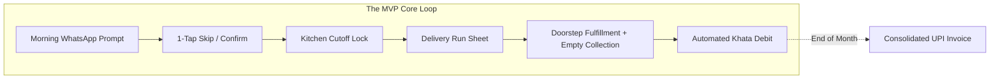

# Minimum Viable Product (MVP) Scope: RUXS

**Classification:** `[CONFIRMED PRODUCT REQUIREMENT]`

---

## 1. MVP Philosophy: The Zero-Friction Beachhead

The purpose of the RUXS Phase 1 MVP is **not** to build a universal all-service super-app. The purpose is to **master the daily coordination loop** between a single local vendor and their existing 50–150 recurring subscribers.

If we can eliminate daily WhatsApp chaos, enforce cutoffs, track container assets, and automate end-of-month UPI payments for 10 tiffin kitchens and water suppliers, the core engine is proven.

---

## 2. In-Scope MVP Features

### 2.1 Customer Experience
* **Phone Authentication:** Zero-password OTP login via SMS/WhatsApp on web (`ruxs.in`).
* **Subscription Management:** View active subscriptions, cadence, and upcoming schedules.
* **1-Tap WhatsApp Interaction:**
  * Interactive morning poll: `[DELIVER]` or `[SKIP]`.
  * Instant feedback message confirming status.
  * Late cancellation warning if submitted after cutoff.
* **Digital Khata View:** Real-time chronological ledger showing all debits, credits, and current outstanding balance.
* **Monthly Invoice & 1-Click Pay:** Clean, itemized web invoice with an instant UPI intent/QR payment link.

### 2.2 Vendor Admin Experience
* **Vendor Setup:** Quick business profile creation (Name, Address, UPI ID, Phone).
* **Service Configuration:**
  * Beachhead categories: **Tiffin** (Lunch/Dinner shifts) and **20L Water Jars**.
  * Cutoff time configuration (e.g., 10:00 AM for lunch).
  * Late cancellation charge policy (e.g., 50% or 100%).
* **Customer Roster:** Manual customer addition by phone number, or sharing a direct onboarding link/QR code.
* **Live Fulfillment Dashboard:**
  * Real-time production counter: *Total meals to prepare*, *Skipped count*, *Pending responses*.
  * Cutoff status timer (e.g., *Cutoff locks in 14 minutes*).
* **Run Sheet Generation:** Sequenced list of deliveries for the day with customer name, address, notes, and skip indicators.
* **Asset Tracking (Water Jars):** Track delivered vs. collected cans at doorstep, maintaining customer jar holding balances.
* **Monthly Billing Dispatch:** 1-click generation of invoices dispatched directly to customers via WhatsApp.

### 2.3 Platform Core
* **RBAC & Tenancy:** Strict vendor data isolation.
* **Idempotent Webhook Ingestion:** Bulletproof handling of WhatsApp Meta webhooks and UPI payment gateway webhooks.
* **Transactional Ledger Engine:** Double-entry ledger mathematics preventing balance corruption.
* **Cron / Background Automation:** Automated morning polling and cutoff locking workers.

---

## 3. Explicitly Deferred Features (Out of MVP Scope)

| Deferred Feature | Target Phase | Concrete Reason for Deferral |
| :--- | :--- | :--- |
| **Advanced Route GPS Optimization & Live ETA** | Phase 3 | Local delivery boys already know their apartment routes intimately. Live GPS tracking burns battery, requires native apps, and adds massive technical overhead without solving core coordination. |
| **NFC Chips / Doorstep Beacons** | Phase 4 | Requires physical hardware procurement, installation costs, and customer compliance. Delivery photo verification or simple driver checkoff suffices for MVP. |
| **Splitwise-Style Roommate Splitting** | Phase 5 | While valuable for flatmates, the primary relationship is between the single bill-payer and the vendor. Adding multi-user split consensus slows down Phase 1 adoption. |
| **Open Consumer Marketplace / Discovery** | Phase 6 | Open marketplaces require massive two-sided liquidity. RUXS launches as **Vendor SaaS**, where vendors bring their own existing, loyal customer base onto the platform. |
| **Complex Multi-Tenancy Roles & Sub-Teams** | Phase 3 | Early vendors are sole proprietors with 1–2 helpers. A simple two-tier model (`VendorAdmin` and `DeliveryStaff`) is sufficient. |
| **Multi-Language WhatsApp Flow** | Phase 2 | English and Hinglish (phonetic Hindi) cover 90%+ of early urban tech-forward beachheads. Full vernacular localisation deferred to Phase 2. |

---

## 4. MVP Launch Criteria & Success Gate

Before opening to external vendors, the MVP must satisfy these non-negotiable functional benchmarks:

1. **Zero Double-Charges:** 100 consecutive simulated WhatsApp skip events must produce 100 accurate ledger entries with zero phantom debits.
2. **Cutoff Boundary Enforcement:** A skip received at `10:00:01 AM` when cutoff is `10:00:00 AM` must strictly transition to `LATE_SKIP` or rejection according to vendor configuration.
3. **Webhook Idempotency:** Duplicate delivery of the exact same WhatsApp webhook ID must result in zero duplicate actions.
4. **End-to-End UPI Flow:** Customer receives invoice on WhatsApp -> clicks link -> pays ₹100 on UPI test gateway -> Khata balance updates to ₹0 within 3 seconds.
