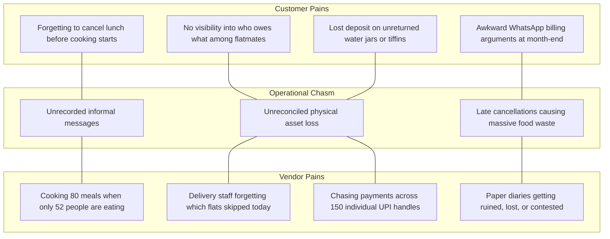

# Problem Statement: The Friction in Recurring Household Services

**Classification:** `[CONFIRMED PRODUCT REQUIREMENT]`

---

## 1. Context: The Invisible Engine of Indian Urban Life

Every household relies on an ecosystem of unorganized, highly fragmented, hyper-local service providers:
* **The Tiffin Kitchen / Mess:** Delivering home-cooked dabbas twice a day to students, bachelors, and working couples.
* **The Water Supplier:** Hauling heavy 20-liter bubble-top RO water jars up stairs every 2–3 days.
* **The Milkman (Doodhwala):** Dropping cow/buffalo milk packets or fresh cans before dawn.
* **The Dhobi / Laundry:** Picking up clothes, ironing, and returning them in batches.
* **The Car Cleaner:** Dusting and wiping vehicles parked in apartments at 5:00 AM.
* **The Scrap / Carton Collector (Raddi-wala):** Collecting piled-up cardboard, plastic, and newspapers monthly.
* **The Flower Vendor:** Supplying fresh morning strings for the home temple.

Collectively, this accounts for an estimated **$50B+ annually in India alone**, dominated by high frequency (daily or alternate-day) and high customer stickiness (relationships lasting years).

---

## 2. The Core Problems for Each Stakeholder

### 2.1 The Customer's Pain Points

1. **High Daily Cognitive Burden:**
   A customer must remember to text the tiffin vendor before 9:30 AM: *"Bhaiya, aaj lunch mat bhejna, I am eating in the office."* If they forget or message late, they pay for an untouched meal.
2. **Messy Dispute & Ledger Tracking:**
   Most customers maintain a door calendar with scribbled pen marks or rely on the vendor's handwritten diary (*Khata*). At the end of the month:
   * Customer: *"Uncle, I was traveling for Diwali from the 12th to the 17th."*
   * Vendor: *"Beta, you only marked the 13th on my copy."*
   Trust erodes, and awkward disputes occur over ₹200–₹500.
3. **Physical Asset Deadlocks:**
   Water vendors take a ₹150–₹300 deposit per 20L can. Over 2 years, cans get exchanged, borrowed by flatmates, or lost during shifting. Customers forfeit deposits; vendors lose valuable can inventory.
4. **Roommate & Household Accounting Chaos:**
   In shared apartments (bachelors/working professionals), one flatmate pays the tiffin aunt ₹6,000, another pays the ₹1,200 water bill, and another pays the car cleaner. Manual entry into third-party apps like Splitwise is forgotten, leading to uneven finances.

---

## 3. The Vendor's Operational Crisis

1. **Unpredictable Daily Demand & Food Waste:**
   For a cloud tiffin service, raw materials (vegetables, paneer, chicken, gas) must be committed by 9:30 AM for lunch prep. When 15 out of 70 customers cancel between 11:00 AM and 1:00 PM via WhatsApp, the cooked meals are ruined. This directly incinerates 15% to 25% of the vendor's net operating margin.
2. **Delivery Boy Miscoordination:**
   The kitchen owner receives WhatsApp cancellations on their personal phone, but the delivery boy is already out on a scooter. Without a live digital run sheet, the delivery boy knocks on doors of people who cancelled, wasting fuel, time, and creating customer friction.
3. **Cashflow Bottlenecks & Late Payments:**
   Vendors spend the first 7 days of every month sending polite WhatsApp reminders: *"Sir, please clear last month's bill of ₹3,420."* Customers procrastinate, forget, or challenge line items, stretching the vendor's working capital dangerously thin.
4. **Asset Bleed:**
   A water supplier with 300 customers has 600+ cans in circulation. Without real-time can accounting at delivery time, 10–15% of cans vanish each year without accountability.

---

## 4. Why Existing Solutions Fail

| Existing Approach | Why It Fails for Recurring Hyper-Local Operations |
| :--- | :--- |
| **Quick Commerce (Blinkit / Zepto / Instamart)** | Built for on-demand impulse grocery, not hyper-local customized meal plans, local milkmen, or returnable asset deposits. High commission (20-30%) kills local vendor economics. |
| **Traditional Food Delivery (Swiggy / Zomato)** | High delivery fees, commissions, and disposable packaging. A ₹80 homestyle daily tiffin cannot bear a ₹40 delivery charge and 25% take-rate. |
| **Generic Khata Apps (Khatabook / OKCredit)** | They are retrospective accounting books (recording debt after it occurs). They have no concept of daily fulfillment state machines, cutoffs, route sheets, or morning WhatsApp polls. |
| **Society ERPs (MyGate / NoBrokerHood)** | Focus on visitor management, guard approvals, and society maintenance fees. They lack service-specific operational depth (e.g. tiffin meal customisation, water can deposits). |
| **WhatsApp Personal Chats** | Completely unstructured. Messages get buried beneath family chats, audio notes cannot be parsed reliably, and there is no relational database behind the text. |

---

## 5. The Root Cause: A Lack of a Coordination Layer

The market does not suffer from a lack of demand or a lack of hardworking local vendors. It suffers from a **coordination failure**. 

RUXS exists to eliminate this coordination vacuum through an automated, predictable, and transparent digital operating layer.
