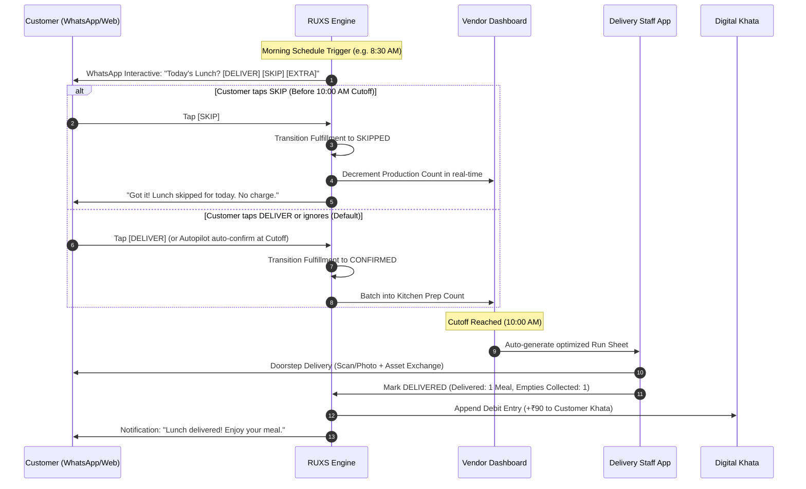

# Solution Architecture: The RUXS Digital Operating Layer

**Classification:** `[CONFIRMED PRODUCT REQUIREMENT]`

---

## 1. High-Level Concept

**RUXS** transforms informal, high-frequency recurring household services into an automated, predictable, and transparent digital workflow.

Instead of replacing the local vendor, RUXS equips both the customer and the vendor with a synchronized operational backbone:

---

## 2. The Core Solution Pillars

### 2.1 WhatsApp-First, App-Optional Accessibility
* **The Problem It Solves:** Indian consumers resist downloading yet another 80MB app for a ₹70 daily meal or a morning milk pouch. Local vendors have low digital literacy.
* **The RUXS Approach:** 95% of daily consumer actions happen directly within WhatsApp using Meta's Cloud API interactive buttons, quick replies, and automated conversational flows. A sleek progressive web app (`ruxs.in`) exists for rich ledger views, detailed invoices, and household settings.

### 2.2 Strict Cutoff Automation
* **The Problem It Solves:** Late cancellations destroy kitchen margins and create vendor-customer rancor.
* **The RUXS Approach:** Every service and shift has an immutable, configurable cutoff time (e.g., 10:00 AM for lunch, 6:00 PM for dinner, 9:00 PM previous night for early morning milk).
  * **Before Cutoff:** 1-tap skip with 0 penalty.
  * **After Cutoff:** State locks. System enforces configured vendor policy (e.g., *Late Cancellation with 50% charge*, or *Cancellation Locked*).

### 2.3 Double-Entry Digital Khata
* **The Problem It Solves:** Disputed monthly bills and forgotten entries in paper diaries.
* **The RUXS Approach:** No balance is ever mutated as a bare number (`balance += 50`). Every balance change requires an immutable, signed ledger transaction with metadata:
  * Timestamp
  * Fulfillment ID
  * Product/Service ID
  * Type (Debit, Credit, Adjustment, Refund, Deposit)
  * Created by (System, Vendor, Customer confirmation)
Both the customer and the vendor view the exact same ledger in real time.

### 2.4 Physical Asset Ledger
* **The Problem It Solves:** Lost water cans, unreturned tiffin dabbas, and confiscated deposits.
* **The RUXS Approach:** Assets are tracked in parallel with money. Each delivery records:
  * Assets Delivered (+1 20L can)
  * Assets Collected (-1 20L can)
  * Net Customer Asset Balance (e.g., 2 cans held)
  * Held Deposit (e.g., ₹300)
If a customer leaves a service, the system automatically checks asset reconciliation before refunding deposit balances.

### 2.5 Dynamic Driver Run Sheets
* **The Problem It Solves:** Delivery boys visiting flats that cancelled hours earlier.
* **The RUXS Approach:** Delivery personnel receive live, sequence-ordered digital run sheets grouped by locality, apartment society, tower, and floor. Skips are instantly struck off the run sheet in real-time, preventing wasted trips.

### 2.6 Integrated Household & Expense Splitting
* **The Problem It Solves:** The friction of dividing shared monthly bills among flatmates or spouses.
* **The RUXS Approach:** A household profile allows multiple users to share a subscription. At the end of the billing cycle (or per delivery), RUXS automatically divides the verified khata charge using equal, percentage, or custom splits, generating native settlement links.

---

## 3. Solution Boundaries: What RUXS Does vs. Does Not Do

| RUXS Does | RUXS Does NOT Do |
| :--- | :--- |
| Provide cloud software for local vendors (SaaS) | Operate centralized dark stores or cloud kitchens |
| Automate order polling, cutoffs, and run sheets | Employ on-demand gig delivery fleets (e.g., Zepto riders) |
| Guarantee immutable financial ledgers & UPI billing | Mark up local vendor food prices to extract consumer take-rates |
| Track physical returnable inventory (dabbas, jars) | Force vendors to rebrand their food or service |
| Provide WhatsApp 1-tap interaction layers | Require all users to install native mobile applications |
