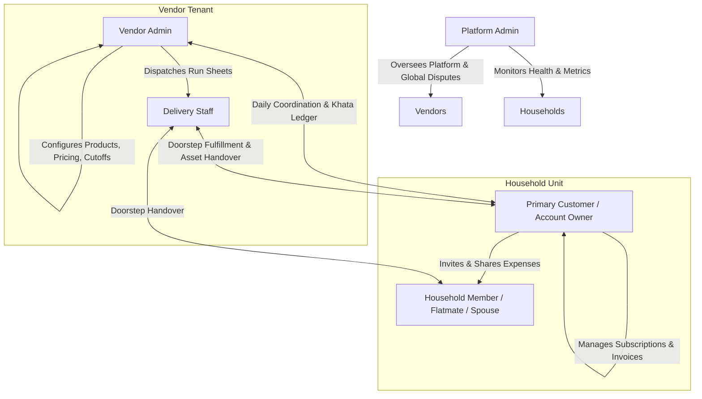

# Target Users and Personas: RUXS

**Classification:** `[CONFIRMED PRODUCT REQUIREMENT]`

---

## 1. System Role Hierarchy

RUXS establishes five distinct actors within the ecosystem:

---

## 2. Detailed Role Definitions & Permissions

### 2.1 Customer (Household Primary Owner)
* **Who they are:** The primary bill-payer or manager of household services (e.g., flatmate in charge of food, or spouse managing kitchen supplies).
* **Key Capabilities:**
  * Discover local vendors via invite code, direct link, or hyper-local directory.
  * Subscribe to recurring services with custom schedules (e.g., Mon–Fri Lunch, Daily Milk).
  * Receive daily morning 1-tap confirmation prompts via WhatsApp or Web.
  * Trigger 1-tap Skips, Extra items, or Vacation Holds across multiple services.
  * Inspect immutable Digital Khata and Asset Ledger in real time.
  * Pay monthly invoices using UPI (Intent, Dynamic QR, or AutoPay).
  * Manage household members and initiate expense splits.
  * Raise dispute tickets with evidence attachments.

### 2.2 Household Member (Secondary Consumer)
* **Who they are:** Roommates, spouses, elder parents, or co-tenants living in the same home.
* **Key Capabilities:**
  * View active household subscriptions and daily delivery statuses.
  * Participate in shared expense splits (equal, custom, percentage).
  * Approve or reject split shares and initiate personal UPI settlements.
  * Optionally trigger daily skips if given delegated permissions by the Primary Owner.

### 2.3 Vendor Admin (Kitchen Owner, Dairy Owner, Water Distributor)
* **Who they are:** Independent business owners running hyper-local recurring services.
* **Key Capabilities:**
  * Onboard their business and configure service catalogs (Tiffin, Milk, Water, etc.).
  * Set cutoffs per service and shift (e.g., Lunch cutoff: 10:00 AM; Dinner cutoff: 6:00 PM).
  * Access real-time Kitchen Production Counters (exact meals to cook).
  * Manage customer subscriptions, manual entries, and phone onboarding.
  * Assign delivery personnel to geographic routes and generate digital run sheets.
  * Track physical asset balances (cans, dabbas) in circulation.
  * Generate and dispatch monthly itemized invoices via WhatsApp.
  * Monitor bank settlements and reconcile offline cash payments.

### 2.4 Delivery Staff (Delivery Rider, Field Boy)
* **Who they are:** Delivery workers operating bicycles, scooters, or small utility vans.
* **Key Capabilities:**
  * Access daily sequence-ordered mobile run sheets (grouped by society, tower, floor).
  * Mark orders as `DELIVERED` or `FAILED` with one tap.
  * Record physical asset handovers (e.g., *Delivered 1 jar, Collected 1 empty*).
  * Capture delivery verification (doorstep photo or customer QR scan).
  * Access 1-tap WhatsApp or phone call dialers for customer assistance.

### 2.5 Platform Admin (RUXS Operator)
* **Who they are:** Internal RUXS engineering, operations, and support staff.
* **Key Capabilities:**
  * Onboard, verify, and suspend vendor accounts.
  * Manage SaaS subscription tiers (Starter, Growth, Pro).
  * Monitor global system health, background job execution, and WhatsApp webhook delivery rates.
  * Intervene in escalated vendor-customer financial disputes.
  * Access anonymized platform-wide analytics and financial transaction logs.

---

## 3. Real-World Personas

### Persona A: Rahul (26, Software Engineer, Shared Flat in Bangalore)
* **Context:** Lives with two flatmates in HSR Layout. Orders lunch and dinner from a neighborhood homestyle tiffin service 5 days a week.
* **Behaviors:** Frequently has impromptu office dinners or plans with friends. Hates having to text the tiffin aunt every other evening.
* **RUXS Solution:** At 5:30 PM, Rahul receives a WhatsApp button: `[DELIVER DINNER]` `[SKIP]`. He taps `[SKIP]` in 2 seconds while walking out of the office. At the end of the month, his ₹4,800 food bill is verified, and RUXS generates an instant split for his flatmates for shared water cans.

### Persona B: Meenakshi (34, Product Manager, Family Home in Pune)
* **Context:** Manages milk (1.5L daily), pooja flowers, two newspapers, and weekly scrap collection for a family of four.
* **Behaviors:** Family travels to native town for 10 days twice a year. Historically had to call the milkman, flower aunt, and paper vendor individually.
* **RUXS Solution:** Sets **Vacation Mode** from Dec 22 to Jan 2 in the RUXS dashboard. The system automatically notifies all three vendors, pauses deliveries, freezes billing, and resumes deliveries automatically on Jan 3 without a single reminder call.

### Persona C: Sharma-ji (48, Cloud Kitchen & Tiffin Operator in Jaipur)
* **Context:** Cooks homestyle lunch and dinner for 110 subscribers. Employs 2 delivery boys.
* **Behaviors:** Spends 2 hours every morning scrolling through 80 unread WhatsApp messages to tally how many rotis and sabzis to make. Lost ₹14,000 last month to late cancellations and forgotten credit entries in his notebook.
* **RUXS Solution:** Opens the RUXS Vendor Dashboard on his tablet. At 10:00 AM sharp, the screen shows: **Total Lunch Required: 84 Meals (72 Regular, 12 Jain, +18 Extra Rotis)**. The delivery boys get digital run sheets automatically. At month-end, 1-click generates 110 itemized WhatsApp invoices with instant UPI collection links.

### Persona D: Ramesh (22, Delivery Staff for Sharma-ji's Kitchen)
* **Context:** Rides a Hero Splendor delivering 45 tiffins across 3 apartment societies in 75 minutes.
* **Behaviors:** Constantly stressed about knocking on the door of someone who cancelled on WhatsApp 30 minutes earlier, leading to angry customers.
* **RUXS Solution:** Pulls up the RUXS Delivery View on his mobile browser. The run sheet is sorted by Tower A (1st to 14th floor) -> Tower B -> Tower C. Skips are highlighted in grey and disabled. He taps `DELIVERED`, logs `1 Dabba Collected`, and moves to the next floor.
