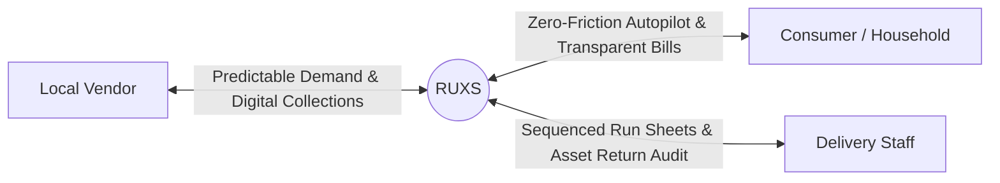

# Value Proposition: RUXS

**Classification:** `[CONFIRMED PRODUCT REQUIREMENT]`

---

## 1. Stakeholder Value Matrix

RUXS operates in a three-sided hyper-local network:
1. **The Household / Consumer**
2. **The Local Service Vendor**
3. **The Delivery & Field Personnel**

---

## 2. Value Proposition for the Customer (Household)

| Feature / Capability | Old World (Informal / Manual) | RUXS World | Concrete Value |
| :--- | :--- | :--- | :--- |
| **Morning Confirmation** | Anxious messaging on WhatsApp or forgetting completely | 1-tap WhatsApp prompt at 8:30 AM (`[DELIVER]`, `[SKIP]`, `[EXTRA]`) | **Zero mental fatigue:** Takes 2 seconds or runs automatically on autopilot. |
| **Vacation / Travel** | Messaging 4 different vendors (milk, tiffin, paper, water) individually | Select vacation dates once in RUXS: all selected recurring services pause automatically | **No accidental deliveries:** Eliminates stale milk packets piling up outside closed doors. |
| **Billing & Transparency** | Door calendar scratches vs. vendor's memory; frequent awkward arguments | Live digital ledger showing every delivery timestamp, skip credit, and payment receipt | **100% trust:** Zero arguments over unverified billing entries. |
| **Flatmate Coordination** | Constant arguments over who paid the tiffin aunt and who owes who what | Native household accounts with Splitwise-style expense sharing & UPI settlement links | **Zero roommate friction:** Seamlessly auto-splits monthly household operational expenses. |
| **Asset Security** | Forfeited ₹500 water can deposits when moving apartments | Verified asset balance in app; transparent deposit refund guarantee | **Asset accountability:** Never lose cash deposits on returnable bottles or dabbas. |

---

## 3. Value Proposition for the Local Vendor

| Operational Area | Without RUXS | With RUXS | Business Impact |
| :--- | :--- | :--- | :--- |
| **Kitchen Planning** | Blind cooking based on yesterday's gut feeling; 15-25% food wastage | Exact locked production count at 10:00 AM sharp | **Direct Margin Expansion:** 12–18% reduction in raw ingredient & cooking wastage. |
| **Cutoff Enforcement** | Customers cancelling at 12:30 PM; vendor forced to eat the cost or fight | System locks cancellations past cutoff; enforces agreed late-cancellation fee | **Loss Prevention:** Vendor never absorbs late cancellation costs unilaterally. |
| **Payment Collection** | Sending 120 individual UPI reminder texts; collection takes 10–14 days | Automated itemized WhatsApp invoices with integrated 1-click UPI links on the 1st of the month | **Cashflow Velocity:** Days Sales Outstanding (DSO) drops from 14 days to under 48 hours. |
| **Customer Retention** | Customers churning due to poor coordination or inaccurate paper billing | High-trust, professional digital experience that rivals venture-backed startups | **Lower Churn:** Customers stay subscribed 3x longer when billing is indisputable. |
| **Asset Recovery** | 10–15% of 20L water cans or premium tiffins lost annually without trace | Delivery boys digitally log container returns at every doorstep | **Inventory Protection:** Eliminates thousands of rupees in lost physical assets. |

---

## 4. Value Proposition for Delivery Personnel

1. **Sequenced Run Sheets:** No more flipping through greasy paper notebooks or reading long WhatsApp chat histories to remember who skipped lunch today.
2. **Doorstep Asset Audits:** Instant tap to record *"1 Jar Delivered, 1 Empty Collected"*. The driver is never falsely accused by the vendor of losing empties.
3. **Optimized Route Flow:** Deliveries grouped by apartment building, society, tower, and flat number, minimizing elevator trips and stair climbs.
4. **Delivery Proof:** Instant photo upload or customer scan defends the delivery boy against false claims of non-delivery.

---

## 5. Value Proposition Summary by Tagline

* **For the Consumer:** *"Your everyday household essentials, completely on autopilot."*
* **For the Vendor:** *"Run your local business with corporate predictability, zero food waste, and instant cash collection."*
* **For the Delivery Staff:** *"Clear daily routes, zero confusion, and proof for every drop."*
