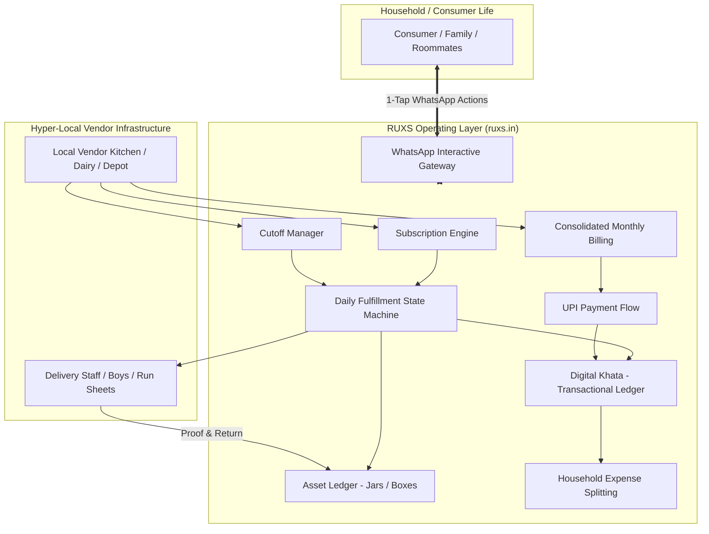
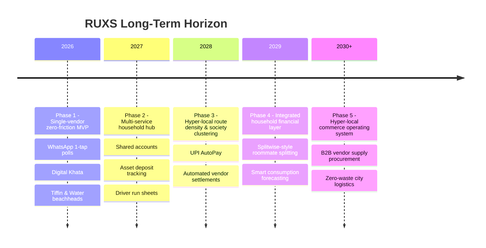

# Product Vision: RUXS

**Brand:** RUXS  
**Domain:** [ruxs.in](https://ruxs.in)  
**Proposed Positioning Direction:** *"Your everyday life, on autopilot."*  
**Classification:** `[CONFIRMED PRODUCT REQUIREMENT]`

---

## 1. Executive Summary

Every day across urban and semi-urban India, tens of millions of households wake up to a rhythm of recurring essential services: fresh milk placed in a doorstep bag, a warm tiffin delivered for lunch, a 20-liter RO water can hoisted into the kitchen, a newspaper tossed onto the balcony, fresh pooja flowers hung on the handle, ironed clothes dropped off by the local dhobi, cars dusted before office hours, and scrap paper bundled for pickup.

These services represent a multi-billion dollar recurring economy. Yet today, this entire foundation runs on:
* Disorganized WhatsApp threads
* Forgotten phone calls
* Scribbled paper notebooks and calendar ticks behind doors
* Verbal commitments and fuzzy memories
* Manual cash collections and awkward UPI reminder nudges
* Untracked physical assets (lost tiffin boxes, missing 20L water cans)

**RUXS is not another quick-commerce delivery marketplace.** We are not deploying a fleet of dark stores to destroy the neighborhood vendor. Instead, **RUXS is the digital operating system for everyday household life.**

The local vendor remains the local vendor. RUXS provides the resilient technological and operational infrastructure underneath that relationship—turning chaotic informal interactions into seamless, automated, zero-friction daily operations.

---

## 2. Core Tenets of the Vision

### Tenet 1: The Operating System, Not the Store
RUXS does not sell milk or cook meals. RUXS powers the coordination, accounting, logistics sequencing, and billing between existing local businesses and their loyal household patrons.

### Tenet 2: Zero-Friction Everyday Autopilot
A consumer should never have to open an app, navigate 5 menus, and checkout every day. The default is set once (e.g., *1L Cow Milk every morning at 6:00 AM*). Daily adjustments happen in 1-tap via WhatsApp (e.g., *Skip today*, *Add 500ml Dahi*). If no action is taken, the system executes on autopilot.

### Tenet 3: Preserving Hyper-Local Economics
Neighborhood vendors have immense trust, geographical density, and hyper-low delivery overhead (a tiffin uncle delivers 80 dabbas within two apartment complexes on a scooter). RUXS empowers them with enterprise-grade operational software (SaaS) so they can run with corporate efficiency while keeping local relationship warmth.

### Tenet 4: Absolute Financial & Asset Transparency
The core tension between vendors and households is billing disputes: *"Uncle, I was out of town from the 12th to the 16th, why are you billing me for milk?"* vs. *"Beta, you never told me before I packed the tiffin."*  
RUXS records every single day's state change into an immutable double-entry Digital Khata and Asset Ledger. At month-end, the invoice is self-evident, fully itemized, and instantly payable.

### Tenet 5: The Single Ledger for the Entire House
Over time, RUXS aggregates all recurring household operational expenses into a single command center. Roommates in Indiranagar or Powai no longer juggle who paid the tiffin uncle vs. who paid the water boy—RUXS manages shared household balances and Splitwise-like settlement directly on top of the actual invoices.

---

## 3. Brand Identity & Positioning

* **Official Brand:** **RUXS**
* **Primary Domain:** `ruxs.in`
* **Brand Pronunciation:** "Rux" (rhymes with luxe)
* **Status:** `[CONFIRMED PRODUCT REQUIREMENT]`
* **Important Rule:** Do NOT rename the project to *DailyOps*. DailyOps was an internal working concept category; RUXS is the public-facing and platform brand.
* **Acronym Stance:** Do NOT invent an artificial expansion for RUXS (e.g., "Recurring Utility X System"). It is a distinct, punchy brand name. Any acronym expansions are reserved for future exploratory branding only.
* **Proposed Positioning Statements:**
  * *Primary:* **"Your everyday life, on autopilot."** `[PROPOSED DESIGN]`
  * *Alternative A:* "The operating system for your household."
  * *Alternative B:* "Zero-friction daily essentials for modern homes."

---

## 4. The 5-Year Horizon

