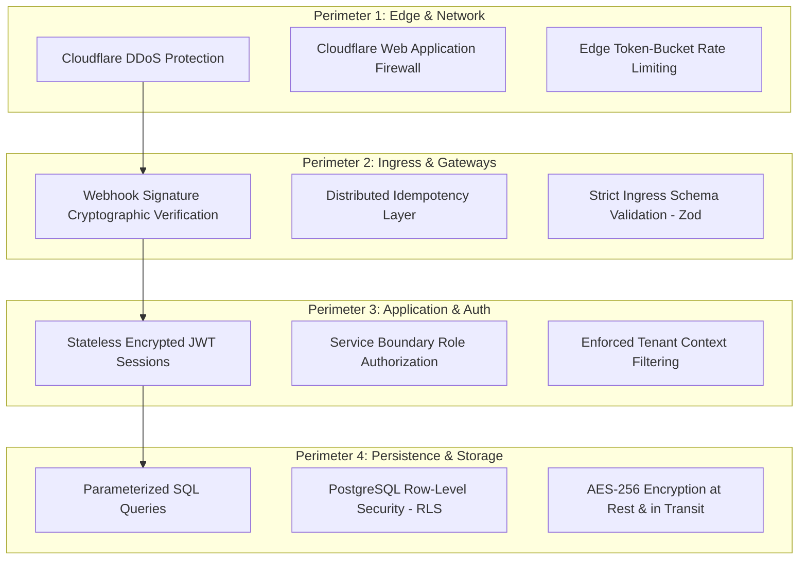

# Security Architecture & Controls: RUXS

**Brand:** RUXS (`ruxs.in`)  
**Classification:** `[CONFIRMED SECURITY SPECIFICATION]`

> **Compliance Notice:** RUXS implements industry-standard security controls. We do **not** claim certifications (such as ISO 27001 or SOC 2) that have not been formally audited and obtained.

---

## 1. Security Architecture Overview

Security in RUXS is implemented using a **Defense-in-Depth Model** across edge, network, application, and persistence perimeters:



---

## 2. Ingress & Webhook Cryptographic Verification

### 2.1 Meta WhatsApp Webhook Verification
Every incoming HTTP POST from Meta contains the `X-Hub-Signature-256` header. The ingestion worker computes an HMAC-SHA256 hash of the raw payload using the `WHATSAPP_APP_SECRET` and performs a constant-time comparison before processing:

```typescript
import { createHmac, timingSafeEqual } from "node:crypto";

export function verifyMetaSignature(rawBody: string, signatureHeader: string, secret: string): boolean {
  if (!signatureHeader || !signatureHeader.startsWith("sha256=")) return false;
  const expectedSignature = signatureHeader.slice(7);
  const calculatedHmac = createHmac("sha256", secret).update(rawBody).digest("hex");
  
  return timingSafeEqual(
    Buffer.from(calculatedHmac, "hex"),
    Buffer.from(expectedSignature, "hex")
  );
}
```

### 2.2 Payment Gateway Webhook Verification
Payment callbacks from gateways (Cashfree / Razorpay) verify an HMAC-SHA256 signature calculated over the combined timestamp and raw payload bytes to prevent replay attacks and tampering.

---

## 3. Application Security Controls

1. **SQL Injection Elimination:** Direct raw SQL concatenation is strictly prohibited. All queries must use parameterized prepared statements via modern TypeScript query builders (e.g., Drizzle ORM).
2. **Cross-Site Scripting (XSS) Prevention:** React Server Components (RSC) and React 19 inherently escape untrusted output. Content Security Policy (CSP) headers block execution of unapproved inline scripts.
3. **Cross-Site Request Forgery (CSRF):** Session cookies use `SameSite=Lax`, `Secure`, and `HttpOnly` flags. State-mutating API routes require a custom anti-CSRF header for browser interactions.
4. **Input Validation & Sanitization:** Every API endpoint validates ingress JSON against strict TypeScript `Zod` schemas, stripping unexpected fields before reaching business services.
5. **Rate Limiting:** Edge-level rate limits configured on Cloudflare:
   * `/api/auth/otp/*`: Max 3 requests per 15 minutes per IP.
   * `/api/webhooks/*`: Up to 100 requests per second with burst allowance.
   * Public Web routes: Max 60 requests per minute per IP.

---

## 4. Secrets Management & Key Rotation

* **Zero Hardcoded Secrets:** Application code and configuration repositories must never contain API tokens, private keys, or database credentials.
* **Environment Injection:** Secrets are injected at runtime via Cloudflare Worker environment bindings (`wrangler secret put ...`) or encrypted production vaults.
* **Key Rotation:** Webhook secrets and encryption keys must support dual-key verification windows during scheduled annual rotation cycles.
