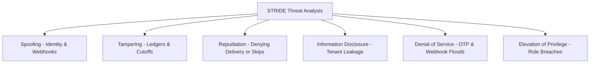

# Threat Model: STRIDE Analysis for Hyper-Local Recurring Operations

**Brand:** RUXS (`ruxs.in`)  
**Classification:** `[CONFIRMED SECURITY SPECIFICATION]`

---

## 1. Methodology: STRIDE Model

To ensure systematic security analysis, RUXS models threats using the Microsoft **STRIDE** methodology across our unique hyper-local operational landscape:

---

## 2. STRIDE Threat Matrix & Mitigations

### 2.1 Spoofing (Identity & Origin)
* **Threat S1: Fake WhatsApp Webhook Injection**
  * *Attack:* Malicious actor sends fake HTTP POST to `/api/webhooks/whatsapp` claiming customer skipped delivery.
  * *Mitigation:* Ingress endpoint rejects any payload failing constant-time HMAC-SHA256 signature verification against `WHATSAPP_APP_SECRET`.
* **Threat S2: Unauthorized Invoice Deep-Link Access**
  * *Attack:* Attacker guesses invoice UUID to view another user's bill.
  * *Mitigation:* Invoice links require either an active authenticated session or a cryptographically signed HMAC token embedding the user ID and expiration.

### 2.2 Tampering (Data Integrity & Invariants)
* **Threat T1: Client-Side Ledger Mutation**
  * *Attack:* Rogue customer intercepts HTTP request and attempts to pass `balance = 0` or negative prices.
  * *Mitigation:* Balances are never client-controlled. Ingress schemas reject arbitrary balance values; prices are frozen server-side from product snapshots.
* **Threat T2: Time-Tampering to Bypass Cutoffs**
  * *Attack:* User sets device clock backwards to 9:45 AM to force a free skip at 10:15 AM.
  * *Mitigation:* The system strictly uses the server-side database transaction timestamp (`NOW()`), completely ignoring client device timestamps.

### 2.3 Repudiation (Disputing Completed Actions)
* **Threat R1: Customer Denies Receiving Delivery**
  * *Attack:* Customer eats meal, then claims on WhatsApp: *"No food arrived."*
  * *Mitigation:* Graduated verification: driver background GPS coordinates (±10m) and optional geotagged drop photo timestamped at door.
* **Threat R2: Vendor Denies Customer Skipped**
  * *Attack:* Kitchen claims customer never cancelled.
  * *Mitigation:* Meta WhatsApp webhook ID, inbound payload, and exact millisecond server receipt timestamp are preserved in an immutable `AuditLog`.

### 2.4 Information Disclosure (Privacy & Leaks)
* **Threat I1: Cross-Tenant Data Leakage**
  * *Attack:* Vendor A queries database or uses API manipulation to view Vendor B's customer lists and sales numbers.
  * *Mitigation:* PostgreSQL Row-Level Security (RLS) policies enforced at the database layer; tenant ID injected from verified session tokens.

### 2.5 Denial of Service (Availability)
* **Threat D1: OTP Endpoint SMS/WhatsApp Exhaustion**
  * *Attack:* Script spams `/api/auth/otp/request` across thousands of numbers, racking up telecom bills.
  * *Mitigation:* Cloudflare edge rate limits (3 requests / 15 mins / IP), device fingerprinting, and progressive CAPTCHA challenges.

### 2.6 Elevation of Privilege (Access Escalation)
* **Threat E1: Delivery Driver Accessing Vendor Financials**
  * *Attack:* Driver crafts API request to fetch vendor monthly payout figures or customer bank details.
  * *Mitigation:* Service boundary RBAC rejects driver requests for financial endpoints with `HTTP 403 Forbidden`.
